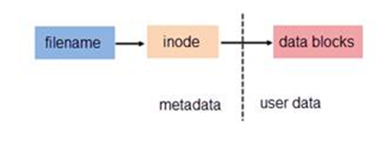
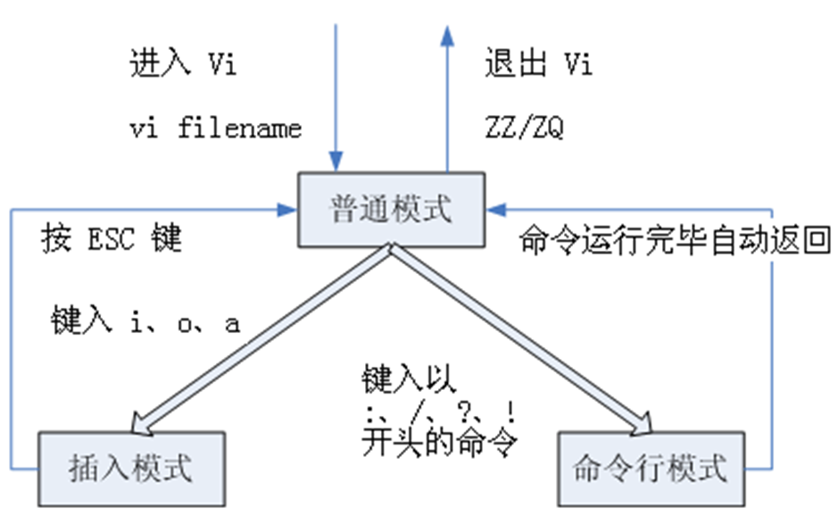

# 字符界面操作进阶

## 学习内容

1. 链接文件
2. 信息显示和文本操作命令
3. 文件查找
4. vi 文本编辑器
5. 命令补全、命令别名、命令历史
6. 重定向、管道、命令替换、命令聚合
7. 掌握 Shell 变量的定义、作用域和使用
8. 掌握 Shell 脚本的使用

## 链接文件

### ln 命令详解

功能：创建链接文件。
格式：`ln [参数] <被链接的文件> <链接文件名>`
参数：

- `-s` ：创建软链接（符号链接）。
- `-f` ：强行创建链接，不论其是否存在。
- `-i` ：覆盖原有文件之前先询问用户。

如：

```bash
 ln somefile hardlinkfile
 ln -s somefile softlinkfile
 ln -s somedir softlinkfile
```

### 文件链接概念

- 文件都有文件名与数据，这在 Linux 上被分成两个部分：用户数据 (user data) 与元数据 (metadata)。用户数据，即文件数据块 (data block)，数据块是记录文件真实内容的地方。
- 元数据则是文件的附加属性，如文件大小、创建时间、所有者、文件所在的 inode（节点）、文件名等信息。 在 Linux 中，元数据中的 inode 号，才是文件的唯一标识，而非文件名。文件名仅是为了方便人们的记忆和使用。系统或程序通过 inode 号寻找正确的文件数据块。
- 多个 filename 可以对应同一个 inode。但一个 filename 不能有多个 inode。



### 硬链接和软链接的比较

- 从硬链接的角度看：硬链接是多个文件名对应同一个 inode。如果将任何一个文件名删除，档案的 inode 与 block 都还存在，依然还可以通过另一个文件名来读取正确的数据。此外，不论用哪一个文件名来编辑，最终的结果都会写入相同的 inode 和 block 中，因此均能进行数据的修改。

  如：A 是 B 的硬链接（A 和 B 都是文件名），则 A 的目录项中的 inode 节点号与 B 的目录项中的 inode 节点号相同，即一个 inode 节点对应两个不同的文件名，两个文件名指向同一个文件，A 和 B 对文件系统来说是完全平等的。如果删除了其中一个，对另外一个没有影响。每增加一个文件名，inode 节点上的链接数增加一。每删除一个对应的文件名，inode 节点上的链接数减一，直到为 0，inode 节点和对应的数据块被回收。

- 从软链接的角度看：软链接就是建立一个独立的文件，而这个文件会让数据的读取指向它 Link 的那个文件的档名，由于只是作为指向的动作，所以当来源档案被删除之后，软连接的档案无法开启，因为找不到原始档名。

  如：A 是 B 的软链接（A 和 B 都是文件名），A 当中的 inode 节点号与 B 当中的 inode 节点号不相同，分别指向两块不同的数据块，存储的内容是不同的。A 的数据块中存放的只是 B 的路径。A 和 B 之间是“主从”关系，如果 B 被删除了，A 仍然还存在（因为两个是不同的文件），但指向的是一个无效的链接。

### 硬链接和软链接的不同

硬链接：

- 链接文件和被链接文件必须位于同一个文件系统内
- 不能建立指向目录的硬链接

软链接：

- 链接文件和被链接文件可以位于不同文件系统
- 可以建立指向目录的软链接

## 文本文件操作命令

常用的文本文件提取和分析命令：

| 命令       | 功能                                                           |
| ---------- | -------------------------------------------------------------- |
| cat, more  | 显示文本文件内容                                               |
| head, tail | 显示文本文件的前或后若干行（横向截取文本文件内容）             |
| cut        | 纵向切割出文本指定的部分（纵向截取文本文件内容）               |
| grep       | 在文本文件中查找指定的字符串（按关键字提取文本文件中匹配的行） |

如：

```bash
# 滚屏显示文件 /etc/passwd 的内容
cat /etc/passwd
# 滚屏显示文件 /etc/passwd 的内容，并显示行号
cat -n /etc/passwd
# 分屏显示文件 /etc/passwd 的内容（注意空格键、回车键和q的使用）
more /etc/passwd
# 从第10行分屏显示文件 /etc/passwd 的内容
more +10 /etc/passwd
# 分屏显示文件 /etc/passwd 的内容（注意空格键、回车键、PgDn键、PgUp键和q的使用）
less /etc/passwd
# 显示文件 myalllist 前4行的内容
head -4 myalllist
# 显示文件 myalllist 后4行的内容
tail -4 myalllist
# 显示文件 myalllist 从10行开始到文件尾的内容
tail +10 myalllist
# 跟踪显示不断增长的文件结尾内容（通常用于显示日志文件）
tail -f /var/log/messages
```

## 管道命令详解

### 管道命令的背景

> UNIX 系统的一个基本思想：一连串的小命令能够解决大问题。

理想情况下，一连串小命令里的每个小命令都能够很好地完成一项单一的工作。现在需要有一些东西能够将这些简单的命令连接起来，这样管道就应运而生。

许多 Linux 命令具有过滤特性，即一条命令通过标准输入端口接受一个文件中的数据，命令执行后产生的结果数据又通过标准输出端口送给后一条命令，作为该命令的输入数据。后一条命令也是通过标准输入端口而接受输入数据。

### 管道命令的使用

管道（使用符号“|”表示）用来连接命令：`命令1 | 命令2`

→ 这表示将命令 1 的 STDOUT 发送给命令 2 的 STDIN。但注意 STDERR 不能通过管道转发。

我们可以用来组合多种工具的功能：`命令1 | 命令2 | 命令3 | ……`

→ 管道线中的每一条命令都作为一个单独的进程运行，每一条命令的输出作为下一条命令的输入。同时由于管道线中的命令总是从左到右顺序执行的，因此管道线是单向的。

> 管道使用练习：
>
> 1. 从 /etc/passwd 文件中提取用户信息，向终端上输出用户的信息格式为*name:uid:gid*
>
>    ```bash
>    head -5 /etc/passwd | tail -1 | cut -d ":" -f 1,3,4
>    ```
>
> 2. 如何从/etc/passwd 当中查找指定的用户名（第一个字段），并只显示该用户的行号？

## sort 命令详解

功能：以行为单位对文件进行排序

格式：`sort [选项] [<文件> …]`

选项：

- `-r` ：逆向排序
- `-f` ：忽略字母的大小写
- `-n` ：根据字符串的数值进行排序
- `-u` ：对相同的行只输出一行
- `-t c` ：使用给定的字符 c 做为列的间隔符
- `-b` ：忽略前导的空格
- `-i` ：只考虑可打印字符
- `-k N` ：以第 N 列进行排序（默认以空格或制表符作为列的间隔符）

如：

```bash
ls -l | sort -nk 5
sort -nrk3 -t : /etc/passwd # 按 uid 和”:“分隔符显示信息
sort -nrk3 -t : /etc/passwd | cut -d : -f 3
df | sort -nrk 2 # 按文件系统磁盘使用空间统计（k 必须和数字直接在一起）
du --max-depth=2 | sort -nk 1 # 按目录显示占用空间大小
```

> 一般来说，选项/参数是没有顺序要求的，但如果是带第二参数或有先后顺序区别时，顺序要求就会变得很重要。

## find 命令详解

功能：在文件系统中查找匹配的文件

格式：`find [<起始目录> ...] [<选项表达式>] [<条件匹配表达式>] [<动作表达式>]`

### 说明

- `<起始目录>`：对每个指定的 `<起始目录>` 递归搜索目录树（省略 `<起始目录>` 表示当前目录）
- `<选项表达式>`：控制 find 命令的行为
- `<条件匹配表达式>`：根据匹配条件查找文件
- `<动作表达式>`：指定对查找结果的操作，默认为显示在标准输出

> 其中不带任何参数的 find 命令将在屏幕上递归显示当前目录下的文件列表。

### 基础选项表达式

| 选项             | 说明                                             |
| ---------------- | ------------------------------------------------ |
| -maxdepth LEVELS | 设置最大的查找深度                               |
| -mount/ -xdev    | 查找文件时不跨越文件系统                         |
| -L               | 如果遇到符号链接文件，就跟踪链接所指的文件       |
| -depth/ -d       | 查找目录自身之前先处理目录中的文件（即深度优先） |
| --help           | 显示 find 命令帮助信息                           |
| --version        | 显示 find 的版本                                 |

如：

```bash
find # 递归显示当前目录的文件列表
find / # 递归显示 / 目录的文件列表
find / -maxdepth 3 # 递归显示 / 目录的文件列表（仅限于3层目录）
find / -xdev # 递归显示 / 目录的文件列表（仅限于 / 文件系统）
find /home /www /srv # 递归显示 /home、/www、/srv 目录的文件列表
```

### 条件匹配表达式

#### 文件名相关

| 条件                | 说明                                               |
| ------------------- | -------------------------------------------------- |
| -name PATTERN       | 匹配文件名                                         |
| -iname PATTERN      | 匹配文件名（忽略大小写）                           |
| -lname PATTERN      | 匹配符号链接文件名                                 |
| -ilname PATTERN     | 匹配符号链接文件名（忽略大小写）                   |
| -wholename PATTERN  | 匹配文件的完整路径（不把 ”/“ 和 ”.“ 作为特殊字符） |
| -iwholename PATTERN | 匹配文件的完整路径（忽略大小写）                   |

> PATTERN 使用 Shell 的匹配模式，可以使用 Shell 的通配符（\*、？[]），但要用 “” 或 ‘’ 括起来

如：

```bash
find -name myfile
find -maxdepth 2 -name symphony
find -name 'd*'
find -name '???'
find -name 'ch[0-2][0-9].txt*'
find -iname '[a-z]*'
find ~ -name "*.txt"
find . -name "[A-Z]*"
find /etc -name "host*"
```

#### 时间属性相关

| 条件     | 说明                                                    |
| -------- | ------------------------------------------------------- |
| -amin N  | 查找 N 分钟以前被访问过的所有文件                       |
| -atime N | 查找 N 天以前被访问过的所有文件                         |
| -cmin N  | 查找 N 分钟以前文件状态被修改过的所有文件（如权限修改） |
| -ctime N | 查找 N 天以前文件状态被修改过的所有文件（如权限修改）   |
| -mmin N  | 查找 N 分钟以前文件内容被修改过的所有文件               |
| -mtime N | 查找 N 天以前文件内容被修改过的所有文件                 |
| -used N  | 查找被改动过之后，在 N 天内被存取过的所有文件           |

> 以上选项中的 N 可以有三种输入方式：N, +N, -N。
>
> 如：
>
> - `20` 表示等于 20
> - `+20` 表示大于 20（21，22，23 等）
> - `-20` 表示小于 20（19，18，17 等）

如：

```bash
# 在 /home 下查找最近2天之内内容修改过的文件：
$ find /home -mtime -2
# 在 /home 下查找最近2天之内被访问过的文件：
$ find /home -atime -2
# 在 /home 下查找60分钟之前改动过的文件：
$ find /home -mmin +60
# 在 /home 下查找最近5分钟之内修改过的文件：
$ find /home -mmin -5
# 在 /home 下查找30分钟之前被访问过的文件：
$ find /home -amin +30
# 在 /home 下查找最近在2日内被改动之后被访问过的文件：
$ find /home -used -2
```

此外，我们还有：

| 条件         | 说明                                                   |
| ------------ | ------------------------------------------------------ |
| -newer FILE  | 查找所有比 FILE 的内容修改时间新的文件                 |
| -cnewer FILE | 查找所有比 FILE 的状态修改时间新的文件（比如权限修改） |
| -anewer FILE | 查找所有比 FILE 的访问时间新的文件                     |

其中 FILE 为要比对的样板文件或目录。

如：

```bash
# 在/home下查找修改时间比 tmp.txt 新的文件或目录：
$ find /home -newertmp.txt
# 在/home下查找访问时间比 tmp.txt 新的文件或目录：
$ find /home -anewer tmp.txt
```

#### 用户和组相关

| 条件             | 说明                                  |
| ---------------- | ------------------------------------- |
| -uidN            | ID 为 N 的用户的所有文件              |
| -gidN            | ID 为 N 的组的所有文件                |
| -user USERNAME   | 用户名为 USERNAME 的所有文件          |
| -group GROUPNAME | 组名为 GROUPNAME 的所有文件           |
| -nouser          | 文件属于不在 /etc/passwd 文件中的用户 |
| -nogroup         | 文件属于不在 /etc/group 文件中的组    |

同样的，N 可以使用 N, +N, -N。

如：

```bash
# 查找在系统中已作废用户（在 /etc/passwd 中无记录）的文件
$ find / -nouser
# 查找在系统中已作废组（在 /etc/group 中无记录）的文件
$ find / -nogroup
# 查找属于 osmond 用户的文件
$ find / -user osmond
# 查找属于 students 组的文件
$ find / -group students
# 查找 UID 为 502 的所有文件
$ find / -uid 502
# 查找 UID 大于 500 的用户的所有文件
$ find / -uid +500
# 查找 GID 小于 60 的所有文件
$ find / -gid -60
```

#### 文件权限相关

| 条件                            | 说明                                                                         |
| ------------------------------- | ---------------------------------------------------------------------------- |
| -perm MODE                      | 精确匹配权限模式为 MODE 的文件                                               |
| -perm -MODE                     | 匹配权限模式至少为 MODE 的文件（用户、组和其他人这三种权限必须都匹配）       |
| -perm /MODE 或 <br/>-perm +MODE | 匹配权限模式至少为 MODE 的文件（用户、组和其他人这三种权限中有一种匹配即可） |

> MODE 与 chown 命令的书写方式一致，既可以使用字符模式也可以使用八进制的数值模式，**通常使用八进制的数值模式**

如：

```bash
# 在 /home 目录下查找权限为 700 的所有文件或目录
$ find /home -perm 700
# 在/home目录下查找权限至少为 740 的所有文件或目录
$ find /home -perm -740
# 在 ~/bin 目录下查找权限为 111 的所有文件或目录（或者所属用户可执行，或者组可执行，或者其他人可执行）
$ find ~/bin -perm /111
```

#### 类型和大小相关

| 条件            | 说明                                                                                                                          |
| --------------- | ----------------------------------------------------------------------------------------------------------------------------- |
| -type TYPE      | 查找类型为 TYPE 的文件，可用的类型：b-块设备文件;c-字符设备文件;d-目录文件;p-命名管道;f-普通文件;l-符号(软)链接;s-socket 文件 |
| -links N        | 查找有 N 个(硬)链接的文件                                                                                                     |
| -inum N         | 查找文件 inode 为 N 的文件                                                                                                    |
| -samefile NAME  | 查找与 NAME 文件具有相同 inode 的文件                                                                                         |
| -size N[bcwkMG] | 查找文件大小为 N 的文件，单位可以为：b-512 字节的块（省略单位的默认值）;c-字节;k-Kilobytes;M-Megabytes;G-Gigabytes            |
| -empty          | 查找空文件（大小为 0）                                                                                                        |

同样的，N 可以使用 N, +N, -N。

```bash
$find . -type d
$find /home -links +2
$find. -size +10k
$find /tmp -size 1G
$find . -size-10M
$ find /var/log -empty
```

### 组合条件表达式

- 可以使用逻辑运算符与、或、非组成的复合条件，并可以用”（）“改变默认的操作符优先级。

- 若以空格作为各个表达式的间隔符，则各个表示式之间是<u>**与**</u>的关系。

| 表达式                | 说明                                                                   |
| --------------------- | ---------------------------------------------------------------------- |
| (EXPR)                | 改变操作符优先次序，一些 UNIX 版的 find 命令要使用 `\( EXPR \)` 的形式 |
| !EXPR                 | 表示对表达式取反                                                       |
| EXPR1 EXPR2           | 与逻辑，若 EXPR1 为假，将不再评估 EXPR2                                |
| <u>EXPR1 -a EXPR2</u> | <u>与 EXPR1 EXPR2 功能一致</u>                                         |
| EXPR1-o EXPR2         | 逻辑或，若 EXPR1 为真，将不再评估 EXPR2                                |
| EXPR1, EXPR2          | 若 EXPR1 为假，继续评估 EXPR2                                          |

如：

```bash
find /tmp -size +10M -a -atime +21
find /home \( -user jjheng -o -user osmond \) -size +10M
find /tmp ! -user osmond
find /mnt -name '*.txt' ! -fstype vfat
find /tmp -name 'l*' -type l
find /var/log -name '*.log' -mtime +5
find -newer FILE1 ! -newer FILE2
```

### 动作表达式

| 表达式                     | 说明                                                                             |
| -------------------------- | -------------------------------------------------------------------------------- |
| -print                     | 在标准输出上列出查找结果（每行一个文件）                                         |
| -ls                        | 使用 ‘ls -dils’ 在标准输出上列出查找结果                                         |
| <u>-prune</u>              | <u>忽略对某个目录的查找</u>                                                      |
| <u>-exec COMMAND {} \;</u> | <u>对符合查找条件的文件执行 Linux 命令</u>                                       |
| -ok COMMAND {} \;          | 对符合查找条件的文件执行 Linux 命令；与 -exec 不同的是，它会询问用户是否需要执行 |

> - `{}` 两个大括号之间不能有空格，表示查找到的对象
> - `\;` 表示命令结束，反斜杠与前面的大括号之间必须要留空格

如：

```bash
# 查找并删除当前目录及其子目录下所有扩展名为 .tmp 的文件
$ find . -name '*.tmp' -exec rm {} \;
# 在logs目录中查找7天之内未修改过的文件并在删除前询问
$ find logs -type f -mtime +7 -ok rm {} \;
# 从当前目录下查找所有以.repo为后缀的文件，并为其改名（添加.bak后缀）
$ find . -name '*.repo' -type f -exec mv {} {}.bak \;
# 查询并删除一周以来从未访问过的以 .o 结尾，或名为 a.out 且不存在于 vfat 文件系统中的所有文件
$ find / ( -name a.out -o -name ‘*.o’ ) -atime +7 ! -fstype vfat -exec rm {} \;

# 排除文件：
# 查找当前目录下（除了 book 目录）之外的所有 .sh 文件
$ find . -name book -prune -o -name '*.sh' -print
# 显示当前目录下（除了 book/server 目录）之外的所有文件
$ find . -path ./book/server -prune -o -print
# 查找当前目录下（除了 book/server 目录）之外的所有 .sh 文件
$ find . -path ./book/server -prune -o -name '*.sh' -print
# 显示当前目录下除 book/server 和 book/server-utf8 目录的所有文件
$ find . -path './book/server*' -prune -o -print
# 查找当前目录下（除了 book/server 和 book/server-utf8 目录）的所有 .sh 文件
$ find . -path './book/server*' -prune -o -name '*.sh' -print
# 查找当前目录下（除了 book/server 和 book/basic 目录）的所有 .sh 文件
$ find . (-path ./book/server -o -path ./book/basic) -prune -o -name '*.sh' -print
# 注意 -prune -o 一般为固定用法，表示排除的列表不再执行后续操作

# 以下表达式等价：
$ find -name \*.sh -exec cp {} /tmp \;
$ find -name '*.sh' -exec cp {} /tmp ';'
$ find -name "*.sh" -exec cp {} /tmp ";"
$ find -name \*.sh -exec cp \{\} /tmp \;
$ find -name '*.sh' -exec cp '{}' /tmp ';'
$ find -name “*.sh” -exec cp “{}” /tmp ";”
```

## vi 文本编辑器详解

### 简介

- vi 是 “Visual interface” 的简称，它可以执行输出、删除、查找、替换、块操作等众多文本操作，而且用户可以根据自己的需要对其进行定制，这是其他编辑程序所没有的。
- vi 不是一个排版程序，它不像 M$ Word 或 WPS 那样可以对字体、格式、段落等其他属性进行编排，它只是一个文本编辑程序。
- vi 是全屏幕文本编辑器，它没有菜单，只有命令。
- vim 即 Vi Improved，vi 克隆版本之一。

### 命令

| **命令**              | **说明**                                                   |
| --------------------- | ---------------------------------------------------------- |
| vi                    | 直接进入                                                   |
| vi filename           | 打开或新建文件 filename，并将光标置于第一行首              |
| vi +n filename        | 打开文件 filename，并将光标置于第 n 行首                   |
| vi+ filename          | 打开文件 filename，并将光标置于最后一行首                  |
| vi +/pattern filename | 打开文件 filename，并将光标置于第一个与 pattern 匹配的串处 |
| vi -r filename        | 打开上次用 vi 编辑时发生系统崩溃，恢复 filename            |

### 3 种运行模式

- 普通（normal）模式
- 插入（insert）模式
- 命令行模式（末行模式）



模式须知：

- Normal 模式下，用户按冒号 “:” 即可进入 Command 模式，此时 vim 会在显示窗口的最后一行 (屏幕的最后一行) 显示一个 “:” 作为 Command 模式的提示符，等待输入命令。

- 多数文件管理都是在此模式下执行的 (如保存文件等)

- Command 模式中所有的命令都必须按 <回车> 后执行，命令执行完后，vim 自动回到 Normal 模式。

- 若在 Command 模式下输入命令过程中改变了主意，可按 Esc 键，或用退格键将输入的命令全部删除之后，再按一下退格键，即可使 vi 回到 Normal 模式下。

### 常见内容操作

- 复制单行（普通模式）：yy
- 剪切单行（普通模式）：dd 或 cc
- 选取内容（普通模式）：输入 v，高亮选取
- 复制指定开始和结束行号之间的内容（命令行模式）：21,27y，然后回车
- 剪切开始和结束行之间的文本：上述方法中的 y 改成 d
- 粘贴文本（普通模式）：在粘贴位置(上一行)按 p 键
- 查找字符串（普通模式）：/或?，输入查找内容，回车。普通模式下按 n 键跳到下一条查找结果，按 N 键上一条结果。
- 撤销上一次操作（普通模式）：u
- 恢复上一次操作：ctrl+u
- 替换当前行内所有指定字符串（命令行模式）：s/old/new/g，如果不加 g 只替换第一个 old
- 替换指定行内所有指定字符串：2,10 s/old/new/g
- 全文替换：% s/old/new/g
- 替换第 n 行到最后一行所有指定字符串：n,$ s/old/new/g
- 替换当前行到最后一行：.,$, s/old/new/g
- 存盘退出 Vi：ZZ

### 常见命令

```bash
:n1,n2 co n3 # 块复制，复制到 n3 后面
:n1,n2 m n3 # 块移动，移动到 n3 后面
:w # 保存当前编辑文件，但并不退出
:w newfile # 存存为名为 “newfile” 的文件
:wq # 存盘退出 Vi
:q! # 用于不存盘退出 Vi
:q # 直接退出 Vi（不做修改）
```

设置 vi 环境：

```bash
:set number # 在编辑文件时显示行号
:set nonumber # 不显示行号
:set autoindent # 缩进,常用于程序的编写
:set noautoindent # 取消缩进
:set tabstop=value # 设置显示制表符的空格字符个数
:set # 显示设置的所有选项
:set all # 显示所有可以设置的选项
```

## 文本文件分析命令

```bash
wc # 统计文本
grep # 在文本文件中查找指定的字符串
sed # 文本流编辑器
```

### wc 命令

功能：统计文本文件的行数、字数、字符数
格式：`wc [选项] [<文件> …]`
如：

```bash
wc file
wc -l file # 统计行数
wc -w file # 统计字数
wc -c file # 统计字符数
wc -L file # 统计最长一行的长度
```

### grep 命令

grep 是一个强大的文本搜索工具。

命令格式：`grep [options] PATTERN [FILE...]`

说明：

- `PATTERN`：查找条件，可以是普通字符串，也可以是正则表达式（RE，通常用单引号将 RE 括起来）。
- `FILE`：是要查找的文件，可以是用空格间隔的多个文件，也可是使用 Shell 的通配符，定义在多个文件中进行查找，省略时表示在标准输入中查找。

> grep 命令不会对输入文件进行任何修改或影响，可以使用输出重定向将结果存为文件。

命令选项：

| 选项         | 说明                                 |
| ------------ | ------------------------------------ |
| -c           | 只显示匹配行的次数                   |
| -i           | 搜索时不区分大小写                   |
| -n           | 输出匹配行的行号                     |
| -v           | 输出不匹配的行（反向选择）           |
| -r           | 对目录（子目录）的所有文件递归地进行 |
| -l           | 列出匹配 PATTERN 的文件名            |
| --color=auto | 对匹配内容高亮显示                   |
| -A NUM       | 同时输出匹配行的后 NUM 行            |
| -B NUM       | 同时输出匹配行的前 NUM 行            |
| -C NUM       | 同时输出匹配行的前、后各 NUM 行      |

如：

```bash
# 在文件 myfile 中查找包含字符串 mystr的行
$ grep mystr myfile
# 显示 myfile 中第一个字符为字母的所有行
$ grep  '^[a-zA-Z]'  myfile
# 在文件 myfile 中查找首字符不是 # 的行（即过滤掉注释行）
$ grep -v '^#' myfile
# 过滤掉/etc/samba/smb.conf的注释行和空行
$ egrep -v ‘^#|^$|^;’ /etc/samba/smb.conf
```

## 正则表达式

正则表达式是使用某种模式（pattern）去匹配（matching）一类字符串的一个公式。

通常使用正则表达式进行查找、替换等操作。在适当的情况下使用正则表达式可以极大地提高工作效率。

### 支持正则表达式的文本处理工具

基本的正则表达式 Basic regular expression (BRE)：

- qgrep 按模式匹配文本
- qsed 一个流编辑器
- qvim 一个屏幕编辑器
- qemacs 一个屏幕编辑器

扩展的正则表达式 Extended regular expression (ERE)：

- qegrep 按模式匹配文本
- qawk 进行简单的文本处理

### 正则表达式的组成

正则表达式由一些普通字符和一些元字符（metacharacters）组成。

普通字符包括大小写的字母、数字（即所有非元字符）；元字符则具有特殊的含义。

正则表达式的元字符：

| 元字符  | 含义                                      | 类型 | 举例         | 说明                        |
| ------- | ----------------------------------------- | ---- | ------------ | --------------------------- |
| ^       | 匹配首字符                                | BRE  | ^x           | 以字符 x 开始的字符串       |
| \$      | 匹配尾字符                                | BRE  | x\$          | 以 x 字符结尾的字符串       |
| .       | 匹配任意一个字符                          | BRE  | l..e         | love, life, live …          |
| ?       | 匹配任意一个可选字符                      | ERE  | xy?          | x, xy                       |
| \*      | 匹配零次或多次重复                        | BRE  | xy\*         | x, xy, xyy, xyyy …          |
| +       | 匹配一次或多次重复                        | ERE  | xy+          | xy, xyy, xyyy …             |
| […]     | 匹配任意一个字符                          | BRE  | [xyz]        | x,y, z                      |
| ()      | 对正则表达式分组                          | ERE  | (xy)+        | xy, xyxy, xyxyxy, …         |
| \{n\}   | 匹配 n 次                                 | BRE  | go\{2\}gle   | google                      |
| \{n,\}  | 匹配最少 n 次                             | BRE  | go\{2,\}gle  | google, gooogle, goooogle … |
| \{n,m\} | 匹配 n 到 m 次                            | BRE  | go\{2,4\}gle | google, gooogle, goooogle   |
| {n}     | 匹配 n 次                                 | ERE  | go{2}gle     | google                      |
| {n,}    | 匹配最少 n 次                             | ERE  | go{2,}gle    | google, gooogle, goooogle … |
| {n,m}   | 匹配 n 到 m 次                            | ERE  | go{2,4}gle   | google, gooogle, goooogle   |
| \|      | 以或逻辑连接多个匹配                      | ERE  | good\|bon    | 匹配 good 或 bon            |
| \\      | 转义字符                                  | BRE  | \\\*         | \*                          |
| ^       | 非（仅用于启始字符）                      | BRE  | [^xyz]       | 匹配 xyz 之外的任意一个字符 |
| -       | 用于指明字符范围 （不能是首字符和尾字符） | BRE  | [a\-zA\-Z]   | 匹配任意一个字母            |
| \\      | 转义字符                                  | BRE  | [\\.]        | .                           |

## sed 命令详解

### sed 简介

sed 是一个流编辑器（stream editor）。sed 是一个非交互式的行编辑器，它在命令行中输入编辑命令、指定被处理的输入文件，然后在屏幕上查看输出。输入文件可以是指定的文件名，也可以来自一个管道的 输出。

与 vi 不同的是 sed 能够过滤来自管道的输入。在 sed 编辑器运行的时候不必人工干涉，所以 sed 常常被称作批编辑器。

sed 默认不改变输入文件的内容，且总是将处理结果输出到标准输出，可以使用输出重定向将 sed 的输出保存到文件中。

### sed 的工作方式

sed 以按顺序逐行的方式工作，过程为：

- 从输入读取一行数据存入临时缓冲区，此缓冲区称为模式空间（pattern space）。
- 按指定的 sed 编辑命令处理缓冲区中的内容。
- 把模式空间的内容送往屏幕并将这行内容从模式空间中删除。
- 读取下面一行。重复上面的过程直到全部处理结束。

### sed 命令

格式：`sed [选项] [-e] cmd1 [[-e cmd2] ... [-e cmdn]] [input-file]...`

说明：

- 在命令行上执行 sed 编辑命令。可以指定多个编辑命令，每个编辑命令前都要使用 -e 参数，sed 将对这些编辑命令依次进行处理。若只有一个编辑命令时，-e 可以省略。
- 每个 sed 的编辑命令 cmdX 均应使用单引号括起来。
- input-file：sed 处理的文件列表，若省略，sed 将从标准输入中读取输入，也可以从输入重定向或管道获得输入。
- 所有用于查询或替换的字符串都要使用 `/…/` 引起来

选项：

- `-r`：使用扩展正则表达式进行模式匹配。
- `-i`：直接对输入文件进行 sed 的命令操作，而不是由屏幕输出。
- `-n`：使用安静（silent）模式。在一般 sed 的用法中，所有来自 STDIN 的资料一般都会被列出到屏幕上。但如果加上 -n 参数后，则只有经过 sed 特殊处理的那一行(或者动作)才会被列出来。如果使用删除(d)的命令，不能使用 -n，否则将会不显示任何内容。
- `-e`：直接在指令列模式上进行 sed 的动作编辑。
- `-f`：直接将 sed 的动作写在一个档案内，`-f filename` 则可以执行 filename 内的 sed 动作。

命令：

- `a`：新增，a 的后面可以接字串，而这些字串会在新的一行出现(目前的下一行)。

- `i`：插入，i 的后面可以接字串，而这些字串会在新的一行出现(目前的上一行)。

- `c`：取代，c 的后面可以接字串，这些字串可以取代 n1,n2 之间的行。

- `d`：删除，因为是删除，所以 d 后面通常不接任何内容；

- `p`：列印，将某个选择的资料列出。

- `/字符串/p`：查询包含字符串的所有行。

- `s`：取代，可以直接进行取代的工作。通常这个 s 的动作可以搭配 g 使用。

- `g`: 行内全面替换。

  > 如：`sed ‘1,20s/old/new/g’ abc`
  >
  > - 如果不加 g，那么每行第一次出现的 old 用字符串 bew 替换；
  > - 加上 g，使得 sed 对所有符合的字符串都被替换。

如：

删除某行

```bash
sed '1d' ab # 删除第一行
sed '$d' ab # 删除最后一行
sed '1,2d' ab # 删除第一行到第二行
sed '2,$d' ab # 删除第二行到最后一行
```

显示某行

```bash
sed -n '1p' ab # 显示第一行
sed -n '$p' ab # 显示最后一行
sed -n '1,2p' ab # 显示第一行到第二行
sed -n '2,$p' ab # 显示第二行到最后一行
```

使用模式进行查询

```bash
sed -n '/ruby/p' ab # 查询包括关键字ruby所在所有行
sed -n '/\$/p' ab # 查询包括关键字$所在所有行，使用反斜线\屏蔽特殊含义
```

增加一行或多行字符串

```bash
$ cat ab
# Hello!
# ruby is me,welcome to my blog.
# end
$ sed '1a drink tea' ab  #第一行后增加字符串"drink tea"
# Hello!
# drink tea
# ruby is me,welcome to my blog.
# end
$ sed '1,3a drink tea' ab #第一行到第三行后增加字符串"drink tea"
# Hello!
# drink tea
# ruby is me,welcome to my blog.
# drink tea
# end
# drink tea
$ sed '1a drink tea\nor coffee' ab   #第一行后增加多行，使用换行符\n
# Hello!
# drink tea
# or coffee
# ruby is me,welcome to my blog.
# end
# 代替一行或多行
$ sed '1c Hi' ab# # #  #第一行代替为Hi
# Hi
# ruby is me,welcome to my blog.
# end
$ sed '1,2c Hi' ab# #    #第一行到第二行代替为Hi
# Hi
# end
```

插入

```bash
# 将 myfile 文件中每行第一次出现的foo用字符串bar替换，然后将该文件内容输出到标准输出
sed -e 's/foo/bar/' myfile
# g 使得 sed 对文件中所有符合的字符串都被替换
sed -e 's/foo/bar/g' myfile
# 选项 i 使得 sed 修改文件
sed -i 's/foo/bar/g' myfile
# 批量操作当前目录下以 m 开头的文件
sed -i 's/foo/bar/g' ./m*
```

其他示例：

```bash
# 将myfile中的所有Windows替换成Linux
sed -i 's/Windows/Linux/g’ myfile
# 功能同上，但不对输入文件本身进行替换，仅在屏幕输出结果
sed 's/Windows/Linux/g' myfile
# 将myfile中所有连续出现的c都压缩成单个的c，仅在屏幕输出结果
sed 's/cc\*/c/g' myfile
# 删除myfile中每一行前导的连续“空白字符”（空格，制表符），仅在屏幕输出
sed 's/^[ \t]\*//' myfile
# 删除myfile中每行结尾的所有空格，仅在屏幕输出
sed 's/ \*$//' myfile
# 删除所有空白行，仅在屏幕输出
sed 's/^$//' myfile
# 在每一行开头加上一个尖括号和空格（引用信息），仅在屏幕输出
sed 's/^/> /' myfile
```

## tar 命令详解

基本功能：打包和解包

格式：`tar [选项] 文件或者目录`

常用选项：

- `-c`：创建新的打包文件。
- `-t`：列出打包文件的内容，查看已经打包了哪些文件。
- `-x`：从打包文件中释放文件。
- `-f`：指定打包文件名。
- `-v`：详细列出 tar 处理的文件信息。
- `-z`：用 gzip 来压缩/解压缩打包文件。
- `-j`：用 bzip2 来压缩/解压缩打包文件。

如：

```bash
tar -cvf myball.tar somedirname
tar -tf myball.tar
tar -xvf myball.tar
tar -zcvf myball.tar.gz somedirname
tar -ztf myball.tar.gz
tar -zxvf myball.tar.gz
tar -jcvf myball.tar.bz2 somedirname
tar -jtf myball.tar.bz2
tar -jxvf myball.tar.bz2
```

> 注意：`-f 文件名|设备名` 是一个整体，所以，
>
> `-cvf myball.tar` 不能写成：`-cfv myball.tar` 或 `-fcv myball.tar`

## 在 BASH 中提高工作效率

### 命令补全

通常用户在 bash 下输入命令时不必把命令输全， shell 就能判断出你所要输入的命令。

该功能的核心思想是：bash 根据用户已输入的信息来查找以这些信息开头的命令，从而试图完成当前命令的输入工作。用来执行这项功能的键是 Tab 键，按下一次 Tab 键后，bash 就试图完成整个命令的输入，如果不成功，可以再按一次 Tab 键，这时 bash 将列出所有能够与当前输入字符相匹配的命令列表。

如：

```bash
# 执行 system-config-network-tui
system <Tab> -config -n<Tab>etwork -t<Tab>ui
# 进入 /etc/sysconfig/network-scripts/ 目录
cd /e<Tab> sys<Tab> c<Tab> ne<Tab> - <Tab>
# 显示 $BASH 变量的值
echo $B<Tab>ASH
```

### 命令历史

bash 可以记录一定数目的以前在 Shell 中输入的命令。

记录历史命令的文本文件由环境变量 HISTFILE 来指定，默认的记录文件是 .bash_history，这是一个隐含文件，位于用户自己的目录中。可以记录历史命令的数目由环境变量 HISTSIZE 的值指定，默认为 1000。

查看命令历史：

```bash
history
history 30  # 查看最近 30 个历史命令
fc –l 30 50 # 列出命令历史中第30到第50之间的命令
```

键盘快捷键：

最简单的方法是用<kbd>↑/↓/←/→</kbd>、<kbd>PgUp</kbd> 和 <kbd>PgDn</kbd> 键来查看历史命令。

如果需要的话，可以使用键盘上的编辑功能键对显示在命令行上的命令进行编辑。

感叹号的用法：

用 `!!` 执行最近执行过的命令
用 `!<命令事件号>` 执行已经运行过的命令
用 `!<已经使用过的命令前面的部分>` 执行已经运行过的以该字符串开头的最近的命令

### 命令别名

允许用户按照自己喜欢的方式对命令进行自定义。

格式：`alias [alias_name='original_command']`

说明：

- `alias_name` 是用户给命令取的别名。
- `original_command` 是原来的命令和参数。若命令中包含空格或其他的特殊字符串必须使用引号。
- 在定义别名时，**等号两边不允许有空格**。
- 不带任何参数的 alias 命令显示当前已定义的所有别名。
- 可以使用 `unalias alias_name` 命令取消某个别名的定义。
- 如果用户需要别名的定义在每次登录时均有效，应该将其写入用户自家目录下的 .bashrc 文件中。

如：

```bash
alias lh='ls -lh'
alias grep='grep --color=auto'
alias gitcam='git commit -a -m'
```

注意：

- 若系统中有一个命令，同时又定义了一个与之同名的别名（例如，系统中有 grep 命令，且又定义了 grep 的别名），则别名将优先于系统中原有的命令的执行。
- 要想临时使用系统中的命令而非别名，应该在命令前添加“\”字符，例如，`$ \grep` 命令将运行系统中原来的 grep 命令而不是 grep 别名，它不在输出中显示颜色。

## 信息显示命令

常用的系统信息显示命令：

| 命令                    | 功能                                        |
| ----------------------- | ------------------------------------------- |
| hostname                | 显示主机名称                                |
| uname                   | 显示操作系统信息                            |
| dmesg                   | 显示系统启动信息                            |
| lsmod                   | 显示系统加载的内核模块                      |
| date                    | 显示系统时间（cal 可以显示系统时间的日历）  |
| env                     | 显示系统环境变量                            |
| locale                  | 显示当前语言环境（cat /etc/sysconfig/i18n） |
| cat /etc/redhat-release | 显示操作系统版本（head -1 /etc/issue）      |
| cat /proc/cpuinfo       | 显示 CPU 信息                               |
| lspci/lsusb             | 显示 PCI/USB 接口信息                       |
| rpm -qa                 | 显示系统已安装的所有软件包                  |

常用的资源显示命令：

| 命令             | 功能                                         |
| ---------------- | -------------------------------------------- |
| top              | 显示当前系统中耗费资源最多的进程             |
| free             | 显示当前内存的使用情况（cat /proc/meminfo）  |
| du -h            | 显示指定的文件（目录）已使用的磁盘空间的总量 |
| df -h            | 显示文件系统磁盘空间的使用情况               |
| uptime           | 显示系统运行时间、用户数、负载               |
| fdisk -l         | 查看所有分区                                 |
| mount            | 查看已经挂装的分区                           |
| swapon -s        | 查看所有交换分区                             |
| ps -ef           | 查看所有进程                                 |
| pstree           | 显示进程树                                   |
| chkconfig --list | 列出所有系统服务                             |

常用的用户相关显示命令：

| 命令       | 功能                   |
| ---------- | ---------------------- |
| who/w      | 显示在线登录用户       |
| whoami     | 显示用户自己的身份     |
| tty        | 显示用户当前使用的终端 |
| id         | 显示当前用户的 id 信息 |
| groups     | 显示当前用户属于哪些组 |
| last       | 查看用户登录日志       |
| crontab -l | 查看当前用户的计划任务 |

常用的网络信息显示命令：

| 命令                 | 功能                       |
| -------------------- | -------------------------- |
| ifconfig             | 显示网络接口信息           |
| route                | 显示系统路由表             |
| iptables -nL         | 显示包过滤防火墙的规则设置 |
| netstat              | 显示网络状态信息           |
| cat /etc/resolv.conf | 显示 DNS 配置              |
| cat /etc/hosts       | 显示静态主机解析表         |

## 进一步使用 SHELL

### 标准输入/输出设备

Linux 命令在执行时常常期望接收输入数据，命令执行后又期望将产生的数据结果输出。

Linux 的大部分命令都具有标准的输入/输出设备端口。

| 名称   | 文件描述符 | 含义     | 设备   | 说明                               |
| ------ | ---------- | -------- | ------ | ---------------------------------- |
| STDIN  | 0          | 标准输入 | 键盘   | 命令在执行时所要的输入通过它来取得 |
| STDOUT | 1          | 标准输出 | 显示器 | 命令执行后的输出结果从该端口送出   |
| STDERR | 2          | 标准错误 | 显示器 | 命令执行时的错误信息通过该端口送出 |

如：

```bash
# 标准输入输出
[root@soho ~]$ cat # 命令等待标准输入
hello # 标准输入的屏幕回显
hello # 标准输出
^D

# 错误输入输出
[root@soho ~]$ cat x
cat: x: 没有那个文件或目录 # 标准错误输出
```

### 重定向

重定向（Redirection），就是不使用系统的标准输入端口、标准输出端口或标准错误端口，而进行重新的指定，所以重定向分为输出重定向、输入重定向和错误重定向。通常情况下重定向到一个文件。

在 Shell 中，要实现重定向主要依靠重定向符实现，即 Shell 是检查命令行中有无重定向符来决定是否需要实施重定向。

重定向符：

| 重定向符 | 说明                                     |
| -------- | ---------------------------------------- |
| <        | 输入重定向                               |
| >        | 覆盖式的输出重定向                       |
| >>       | 追加式的输出重定向                       |
| 2>       | 覆盖式的错误输出重定向                   |
| 2>>      | 追加式的错误输出重定向                   |
| &>       | 同时实现输出重定向和错误重定向（覆盖式） |

如：

```bash
$ ls -l /tmp >mydir
$ ls -l /etc >>mydir

$ myprogram 2> err_file
$ myprogram &> output_and_err_file

$ find  ~  -name *.mp3 > ~/cd.play.list
$ echo “Please call me : 68800000”>message

$ cat <<! >mytext
> This text forms the content of the heredocument ,
> which continues until the end of text delimiter
> !
```

### 输出重定向与空设备

空设备（/dev/null）是个黑洞，发往它的任何内容都将不复存在，经常用于屏蔽命令的输出或错误输出，尤其用于 Shell 脚本中。
如：

```bash
# 屏蔽命令的输出和错误输出
$ myprogram &> /dev/null
$ myprogram >/dev/null 2>&1
# 清空文件内容
$ cp /dev/null  myfile
$ > myfile
```

### 管道应用

如：

```bash
$ ls -lR /etc | less
$ tail +15 myfile | head -3
$ man bash | col -b > bash.txt
# echo "p4ssW0rd" | passwd --stdin user1

$ ls -l | grep "^d"
$ cat /etc/passwd | grep username
$ dmesg | grep eth0
$ rpm –qa | grep httpd

$ echo "test email" | mail -s "test" user@example.com
$ echo "test print" | lpr

# 统计磁盘占用情况
# 统计当前目录下磁盘占用最多的10个一级子目录
$ du . --max-depth=1 | sort -rn | head -11
# 以降序方式显示使用磁盘空间最多的普通用户的前十名
$ du * -cks | sort -rn | head -11
# 以排序方式查看当前目录（不包含子目录）的磁盘占据情况
$ du -S | sort -rn | head -11

# 统计进程
# 按内存使用从大到小排列输出进程。
$ ps -e -o "%C : %p : %z : %a"|sort -k5 -nr
# 按CPU使用从大到小排列输出进程。
$ ps -e -o "%C : %p : %z : %a"|sort -nr
```

### T 型管道

T 型管道（tee）

格式：`命令1 | tee 文件名 | 命令2`

功能：将命令 1 的 STDOUT 保存在文件名中，然后管道输入给命令 2

应用场景：

- 保存不同阶段的输出
- 复杂管道的故障排除
- 同时查看和记录输出

### 命令替换

命令替换（Command Substitution）

使用命令的输出，常用于：在文本中嵌入命令的执行结果，或命令参数是另一个命令执行的结果。

使用方法：
`$(command)` 或 \`command\`

`cmd1 $(cmd2)` 或 cmd1 \`cmd2\`

如：

```bash
echo The present time is `date`
rpm -qi $(rpm -qf $(which date)) # 嵌套
```

### 命令聚合

| 命令行形式     | 说明                          | 举例                                           |
| -------------- | ----------------------------- | ---------------------------------------------- |
| CMD1 ; CMD2    | 顺序执行若干命令              | pwd;date;ls                                    |
| CMD1 && CMD2   | 当 CMD1 运行成功时才运行 CMD2 | gzip mylargefile && echo “OK.”                 |
| CMD1 \|\| CMD2 | 当 CMD1 运行失败时才运行 CMD2 | write osmond \|\| mail -s test osmond < my.log |
| (CMDLIST)      | 在子 Shell 中执行命令序列     | (date; who \| wc -l ) > ~/login-users.log      |
| {CMDLIST}      | 在当前 Shell 中执行命令序列   | { cd /home/jjh; chown jjh:bin s\* ;}           |
