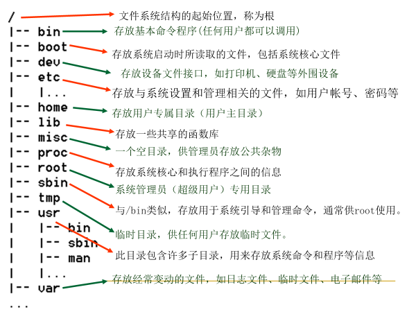

# Linux 介绍和安装

关于 Linux 的历史发展和在虚拟机内安装的讲解。

## Linux 与 Unix 的关系

### 从 Unix 提出到 GNU

- 1970s：贝尔试验室与另一实验室一起开发了 B 语言和开源的 Unix 操作系统。
- Unix 被其他公司继续深造开发出新系统，不免费非开源且昂贵。
- GNU 计划被提出：操作系统层面即为 Linux 系统

GNU 系统设计：硬件 → Kernel 内核 → GNU Shell → 各种功能操作实现

### 从 Minix 到 Linux

荷兰某大学教师为了讲解操作系统课程，发布了类 Unix 操作系统 Minix。开放全部源代码给大学教学和研究工作。此为 Linux 前身。

Unix 经历多个分支的开发和筛选，Linux 最终成为最流行最活跃的分支，得到了全世界的认可。Linux 完美继承了 GPL 协议，并由全世界程序员共同完成、参与维护。

## Linux 系统的特点

- 免费，开源
- 具有出色的稳定性和速度性能
- 优异的**高并发性**（大部分企业级项目都部署到 Linux 或 Unix）
- 具有可靠的**系统安全性**（操作系统的安全漏洞 90% 来自 Windows，10%来自 Linux）
- 标准兼容性和可移植性
- 提供了良好的用户界面

## Linux 的应用领域

- Linux 服务器
- Linux 嵌入式系统
- 可裁剪和定制，最小达到几百 KB
- Android
- 软件开发环境
- Linux 桌面应用
- Linux 多媒体与电影制作

## Linux Shell

### 进入 Shell（字符工作方式）的方法

- 在图形环境下开启终端窗口进入字符工作方式。
- 在系统启动后直接进入字符工作方式。
- 使用远程登录方式（SSH 或 Telnet）进入字符工作方式。

### Shell 的重要功能

- 命令行解释
- 命令的多种执行顺序
- 命令补全、别名机制、命令历史
- 通配符（ wild-card characters )
- I/O 重定向（ input/output redirection )
- 管道（pipes）
- 命令替换（ \`\` 或 s() ）
- Shell 编程语言（ Shell Script )

### 命令基本格式

一般格式：`cmd [options] [arguments]`

说明：

- 最简单的 Shell 命令只有命令名，复杂的 Shell 命令可以有多个选项和参数。
- 选项和参数都作为 Shell 命令执行时的输入，它们之间用空格分隔开。

> 注意：命令区分大小写。

### 文件的类型

- 普通文件（ - ）
- 目录 ( d ）
- 符号链接（ I ）
- 字符设备文件 ( c )
- 块设备文件 ( b )
- 套接字 ( s ）
- 命名管道 ( p )

## 目录与目录操作

### 用户目录结构

- 用户登录后，将会进入一个系统指定的专属目录，即用户的主目录，该目录名通常为用户的登录账号。

  比如：用户 osmond 的主目录为：`/home/osmond`

- 在创建用户时，系统管理员会给每个用户建立一个主目录，通常在 `/home/` 目录下。
- 用户对自己主目录的文件拥有所有权，可以在自己的主目录下进行相关操作。
- 每个用户名对应一个用户 ID 号（一串数字）；每个用户都被分配到一个指定的组（group）中。
- 默认情况下 RHEL/CentOS 在创建用户的同时会创建一个和用户同名的私有组。

### Linux 系统目录结构

Linux 文件系统是一个目录树的结构，文件系统结构从一个根目录开始，根目录下可以有任意多个文件和子目录，子目录中又可以有任意多个文件和子目录。 Linux 的这种文件系统结构使得一个目录和它包含的文件/子目录之间形成一种层次关系。

### 目录操作命令

用户登录后进入的目录通常是自己的主目录。

- `pwd` 命令：查看当前目录
- `cd` 命令：切换/进入目录

一些特殊字符表示的含义：

- `.` 表示当前目录
- `..` 表示当前目录的上一级目录（父目录）
- `-` 表示用 cd 命令切换目录前所在的目录
- `~` 表示用户主目录的绝对路径名

### 路径 (path)

路径是指文件或目录在文件系统中所处的位置。 绝对路径：

- 以斜线 `/` 开头
- 描述到文件位置的完整说明
- 任何时候你想指定文件名的时候都可以使用

相对路径：

- 不以斜线 `/` 开头
- 指定相对于你的当前工作目录而言的位置
- 可以被用作指定文件名的快捷方式

### ls 命令详解

功能：显示文件或目录信息

格式：`ls [选项] [目录或是文件]`

说明：

- 对于目录，该命令将列出其中的所有子目录与文件。
- 对于文件，ls 将输出其文件名以及所要求的其他信息。
- 默认情况下，输出条目按字母顺序排序。
- 当未给出目录名或文件名时，就显示当前目录的信息。

命令选项：

| 选项 | 说明                                            |
| ---- | ----------------------------------------------- |
| -a   | 列出目录下的所有文件，包括以 . 开头的隐含文件。 |
| -l   | 列出文件的详细信息，通常称为 “长格式”。         |
| -d   | 输入参数是目录时，只显示该目录本身。            |
| -A   | 显示除 `.` 和 `..` 外的所有文件。               |
| -R   | 递归地列出所有子目录下的文件。                  |
| -h   | 以人类易读的单位显示文件大小。                  |
| -S   | 以文件大小排序输出。                            |
| -t   | 以时间排序输出。                                |

如：

| ls                 | 列表显示当前目录下的文件和目录                          |
| ------------------ | ------------------------------------------------------- |
| ls -a              | 列表显示当前目录下的文件和目录（包括隐含文件和目录）    |
| ls -l              | 以长格式列表显示结果                                    |
| ls -R              | 递归地显示当前目录及其子目录下的文件和目录              |
| ls -dl /usr/share/ | 仅显示/usr/share/目录本身，而非/usr/share/ 目录中的内容 |
| ls -lt             | 按最后修改时间顺序，以长格式列出当前目录下的文件        |

### mkdir 和 tree 命令详解

mkdir 用于创建文件/目录。如：

- `mkdir /home/lrj/mybin` ：创建一个空目录
- `mkdir -p mydoc/FAQ` ：创建一个空目录树
- `mkdir -p /srv/www/{abc,bcd}/htdocs` ：创建 _/srv/www/abc/htdocs_ 和 _/srv/www/bcd/htdocs_ 目录

tree 用于显示目录树。如：

- `tree /srv/www` ：显示 _/srv/www_ 目录树
- `tree -L 3 /srv` ：显示 _/srv/_ 的 3 级目录树

### 常用的文件操作命令

| 命令      | 功能                           |
| --------- | ------------------------------ |
| touch     | 生成一个空文件或更改文件的时间 |
| cp        | 复制文件或目录                 |
| mv        | 移动文件或目录、文件或目录改名 |
| rm        | 删除文件或目录                 |
| ln        | 建立链接文件                   |
| find      | 查找文件                       |
| file/stat | 查看文件类型或文件属性信息     |

### cp 命令详解

功能：复制文件或目录。 格式：`cp [参数] <源> <目标>` 说明：

- 若复制的目标文件已存在，则被覆盖。
- 可以将多个源文件复制到目标目录中。
- 可以将源目录复制为指定的目标目录（目标目录不存在）。
- 可以将源目录复制到指定的目标目录中。

命令选项：

| 参数   | 说明                                                                           |
| ------ | ------------------------------------------------------------------------------ |
| -a     | 等价于 –dpR                                                                    |
| -r, -R | 递归地复制目录及目录内的所有项目                                               |
| -p     | 在复制文件过程中保留文件属性，包括属主、组、权限与时间戳                       |
| -d     | 当复制符号链接的源文件时，目标文件也将创建符号链接且指向源文件所链接的原始文件 |
| -f     | 强制复制，不管目标是否存在不需要确认                                           |
| -i     | 交互式复制，覆盖文件前需要确认                                                 |
| -u     | 只有当源文件的状态改变时间（ctime）比目标文件更新时或目标尚不存在时才进行复制  |

如：

| cp file1 file2                        | 将当前目录下的 file1 复制为 file2                            |
| ------------------------------------- | ------------------------------------------------------------ |
| cp some/dir/file1 someother/dir/      | 将某目录下的文件复制到另一个目录                             |
| cp /bin/cpio \~/bin                   | 复制文件 /bin/cpio 到 \~/bin 目录                            |
| cp bc bcd mydoc                       | 将两个指定的文件复制到 mydoc 目录下                          |
| cp some/dir/f\* someother/dir/        | 将某目录下的以 f 开头的文件复制到另一个目录                  |
| cp /bin/?sh .                         | 使用“?”通配符复制多个文件到当前目录下                        |
| cp file{1,2,3} someother/dir/         | 将当前目录下的 file1、file2、file3 复制到另外一个目录        |
| cp /etc/httpd/conf/httpd.conf{,.orig} | 将/etc/httpd/conf/目录下的 httpd.conf 拷贝成 httpd.conf.orig |
| cp -r some/dir/ someother/dir/        | 将某目录下的所有文件（包括子目录）复制到另一个目录           |

mv 和 rm 命令详解

mv 用于移动文件。如：

- `mv file file.bak`
- `mv file1 mydata/`
- `mv -i file1 mydata/file2`
- `mv datadir1 /home/zhang/data`

rm 用于删除文件。如：

- `rm ash`
- `rm .*`
- `rm -f file {1,3,5}`
- `rm -r myusr/`
- `rm -rf myusr/`

### \[总结] Linux 常用命令

| 命令        | 功能          | 命令              | 功能               |
| ----------- | ------------- | ----------------- | ------------------ |
| cat         | 查看文件内容  | more/less         | 查看文件内容       |
| cd          | 切换工作目录  | touch             | 改变文件的时间属性 |
| chown       | 改变文件属权  | mv                | 改名或移动文件     |
| chmod       | 改变文件权限  | pwd               | 显示当前所在的目录 |
| clear       | 清除屏幕      | rm                | 删除文件或目录     |
| cp          | 拷贝文件      | find              | 查找文件           |
| ln          | 创建文件链接  | which             | 寻找命令           |
| ls          | 显示目录内容  | tar               | 文件打包           |
| mkdir rmdir | 创建/删除目录 | \[g]zip/unzip 7za | 文件压缩和解压     |

### 通配符

`*` ：匹配任何字符和任何数目的字符

`?` ：匹配单一数目的任何字符

`[ ]` ：匹配 \[ ] 之内的任意一个字符

`[! ]` ：匹配除了 \[! ] 之外的任意一个字符，! 表示非的意思

> 注意：`*` 能匹配文件或目录名中的 `.` ，但不能匹配首字符是 `.` 的文件或目录名。

如：

- `ls *.c`：列出当前目录下的所有 C 语言源文件。
- `ls /home/*/*.c`：列出 /home 目录下所有子目录中的所有 C 语言源文件。
- `ls n*.conf`：列出当前目录下的所有以字母 n 开始的 conf 文件。
- `ls test?.dat`：列出当前目录下的以 test 开始的，随后一个字符是任意的 .dat 文件。
- `ls [abc]*`：列出当前目录下的首字符是 a 或 b 或 c 的所有文件。
- `ls [!abc]*`：列出当前目录下的首字符不是 a 或 b 或 c 的所有文件。
- `ls [a-zA-Z]*`：列出当前目录下的首字符是字母的所有文件。

## 使用 VMWare 安装 Fedora

虚拟机并不是一台实际工作的计算机，而是存在于真实计算机上通过软件模拟来实现的计算机。虚拟机中有自己的 CPU、主板、内存、BIOS、显卡、硬盘和光驱等。在 Windows 操作系统中安装虚拟机，用户可以利用虚拟机来安装 Fedora。

先进的虚拟技术可以使得模拟出来的虚拟机与真正的计算机没什么区别，所以用户可以在虚拟机中实现各种应用，如分区、格式化、安装系统和应用软件等。而这些操作对用户实际计算机系统并没有任何影响。

### 安装前的准备

- 获得安装光盘
- 收集计算机硬件信息
- 为安装 Linux 系统规划硬盘空间
- 为安装 Linux 系统规划网络配置信息
- 准备虚拟机

### 安装 VMware

VMware Wrokstation 的安装方法很简单，双击下载到的安装文件。用户只需要按照安装提示进行默认设置即可。

### 创建虚拟机

使用 VMware 时需要创建一个新的虚拟机，然后才能在创建的虚拟机安装需要的操作系统。首先进入在 VMware Workstation 的主界面，并单击【新建虚拟机】，此时会弹出【新建虚拟机向导】对话框，在该对话框中单击【下一步】按钮来选择适合的配置。

### 在虚拟机中安装 Fedora

新建的虚拟机与真实计算机一样，要想使它工作还必须为该虚拟机安装操作系统。VMware Workstation 支持光盘启动安装，也支持 ISO 镜像文件安装。为了提高安装系统的速度，可以使用 ISO 镜像文件安装 Fedora Core。
