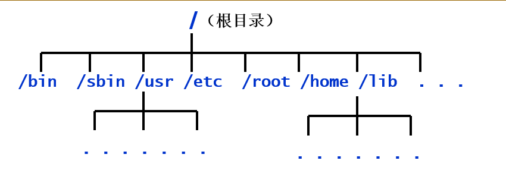
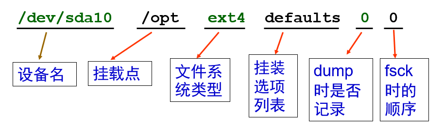

# 文件系统管理

关于 Linux 文件系统操作的讲解。

## 内容要点

- Linux 文件系统概述
- 挂装和卸装文件系统
- 使用各种文件系统
- ext2/ext3 文件系统管理
- 磁盘限额

### 本章学习目标

- 理解 Linux 文件系统的概念
- 学会挂装和卸装文件系统
- 学会使用各种移动存储介质
- 掌握 ext3/ext4 文件系统的创建、管理、维护
- 学会配置磁盘限额

## 文件系统的概念

文件系统（File System）是包括在一个磁盘（硬盘、光盘及其它存储设备）上的目录结构；一个磁盘设备可以包含一个或多个文件系统。

- 文件系统是在一个磁盘（硬盘、光盘及其它存储设备）上组织文件的方法。
- 文件系统是文件的数据结构或组织方法。
- 文件系统是基于被划分的存储设备上的一种文件的命名、存储、组织及读取的方法。

一个文件系统是有组织存储文件或数据的方法，目的是易于查询和存取。文件系统是基于一个存储设备，比如硬盘或光盘，并且包含文件文件物理位置的维护。

### Linux 的文件系统结构

Linux 下的所有文件和目录以一个树状的结构组织构成了 Linux 中的文件系统。其中，我们有标准：

- Linux 文件系统标准（Linux File System Standard，FSSTND）
- 文件系统层次结构标准（File System Hierarchy Standard，FHS）



### Linux 支持的文件系统

Linux 的内核采用了称之为虚拟文件系统（Virtual File System，VFS）的技术，因此 Linux 可以支持多种不同的文件系统类型。

Linux 可支持的文件系统：

- Linux 目前几乎支持所有的 UNIX 类的文件系统，如 HFS、XFS、JFS、Minix FS 及 UFS 等
- Linux 支持 NFS 文件系统
- Linux 也支持 NTFS 和 vfat（FAT32）

Linux 下常见的文件系统：

ext3/ext4（Linux 使用的标准文件系统） swap（交换文件系统） FAT32/vfat（Windows 文件系统） NFS（网络文件系统） iso9660（标准光盘文件系统）

### Linux 支持的日志文件系统

Linux 支持的日志文件系统：

- ext3/ext4
- JFS（IBM）
- XFS（ SGI ）
- Reiserfs

日志文件系统的优点：

- 提高了文件的存储安全性
- 降低了文件被破坏的机率
- 缩短了对磁盘的扫描时间
- 减少了磁盘整体扫描次数

### 使用 Linux 文件系统的一般方法

在硬盘上创建分区或逻辑卷：使用 fdisk 命令创建分区。 在分区/LV 上建立文件系统：类似于在 Windows 下进行格式化操作。 挂装文件系统到系统中：

- 手工挂装：使用 mount 命令。
- 启动时自动挂装：编辑 “/etc/fstab” 添加相应的配置行。

卸装文件系统：对于可移动介质上的文件系统，当使用完毕可以使用 umount 命令实施卸装操作。

## ext2/ext3 文件系统管理

### 创建文件系统（命令 mkfs）

命令格式：`mkfs -t <fstype> -c <分区设备名>` 选项：

- `-t fstype`：指定文件系统类型
- `-c`：建立文件系统前先检测有无坏块

如：

```bash
mkfs -t ext3 -c /dev/hda2
mkfs -t vfat /dev/hdb2
mke2fs -c /dev/hda2
mkfs.ext3 /dev/sda1
```

### 检查文件系统（命令 fsck）

fsck 是操作系统扫描文件系统内容检查内部一致性的工具。

主要功能：

- 检测并修正链接中断的目录
- 检测并修正错误时间标记
- 检测并修正指向错误磁盘区域的 i-node

命令格式：`fsck [选项][-t 文件系统类型] <设备名> [特定文件系统的附加选项]`

如：

```bash
# 检查文件系统，对所有问题回答“yes”
fsck -t ext3 /dev/sdb2

# 自动检查并修复文件系统
e2fsck  -p  /dev/sda5

# 强制进行文件系统检查，标识损坏区块，对所有问题回答“yes”
fsck.ext3  -f  -y  /dev/hda2
```

### 检查文件系统注意事项

一般情况下，无需用户手动执行 fsck 命令。

在系统启动过程中， 一旦系统检测到了不一致就会自动运行 fsck 命令。手动执行 fsck 命令，应该在单用户模式且文件系统被卸装的情况下进行。

### 显示和调整文件系统属性

显示文件系统属性参数：

```bash
tune2fs -l <device>
dumpe2fs -h <device>
```

可调整的文件系统属性参数：

- 保留块
- 默认挂载选项
- fsck 频率

### tune2fs 命令详解

格式：`tune2fs [<选项>] <设备名>` 常用选项：

- `-c`：表示文件系统在 mount 次数达到设定后，需要运行 fsck 检查文件系统。
- `-i`：文件系统的检查间隔时间。系统在达到时间间隔时，自动检查文件系统。
- `-l`：显示文件系统的很多参数。
- `-j`：为 ext2 文件系统添加文件系统日志，转换为 ext3 文件系统。
- `-m`: 设置保留的空间百分比，预设为 5%。
- `-o`: 设置默认加载参数。
- `-L`: 为指定设备设置卷标，不大于 16 字符。

如：

```bash
# 设置默认挂载参数
tune2fs -o acl,user_xattr /dev/sda1
# 将ext2文件系统转换成ext3文件系统。
tune2fs -j /dev/sdb2
# 将每两次完整性检查之间的装载次数调整为10次。
tune2fs -c 10 /dev/sdb5
# 将每两次完整性检查的时间间隔调整为2个月。
tune2fs -i 2m /dev/sdb5
# 调整指定文件系统的预留块比例为2%。
tune2fs -m 2 /dev/sdb5
# 禁用强制文件系统检查
tune2fs -i0 -c0 /dev/sda1
```

### 维护文件系统的卷标（命令 e2label/findfs）

#### 命令 e2label

功能：用于显示或设置指定 ext2 或 ext3 分区的卷标。 格式：`e2label <设备> [新的卷标名称]` 如：

```bash
e2label  /dev/sda10  www
```

#### 命令 findfs

功能：在系统中查找指定卷标的文件系统 格式：`findfs LABEL=<文件系统卷标>` 如：

```bash
findfs LABEL=www
```

## 挂装和卸装文件系统

### 挂装文件系统（命令 mount）

功能：挂装文件系统

格式：`mount [选项] [<分区设备名>] [<挂装点>]`

常用选项：

- `-t <文件系统类型>`：指定文件系统类型
- `-r`：使用只读方式来挂载
- `-a`：挂装/etc/fstab 文件中记录的设备
- `-o iocharset=cp936`：使挂装的设备可以显示中文文件名
- `-o loop`：使用回送设备挂装 ISO 文件和映像文件

如：

```bash
mount
mount -l
mount --guess /dev/sda3

mount –t ext4 /dev/sdb1 /opt
mount –t vfat /dev/hda6 /mnt/win
mount –t vfat –o iocharset=cp936  \
   /dev/hda8  /mnt/win2
```

### 卸装文件系统

格式：`umount <分区设备名或挂装点>` 如：

```bash
umount /dev/hda6
umount /dev/sdb1
umount /opt
```

### 挂装/卸装文件系统的注意事项

- 挂装点目录必须存在
- 应该在挂装目录的上级目录下进行挂装操作
- 不该在同一个挂装点目录下挂装两个文件系统
- 当文件系统处于“busy”状态时不能进行卸装

文件系统何时处于“busy”状态：

- 文件系统上面有打开的文件
- 某个进程的工作目录在此文件系统上
- 文件系统上面的缓存文件正在被使用

### fuser 命令详解

fuser 命令可以根据文件（目录、设备）查找使用它的进程，同时也提供了杀死这些进程的方法。

如：

```bash
# 查看挂装点有哪些进程需要杀掉
fuser -cu /mount_point
# 杀死这些进程（向其发送 [SIGKILL,9] 信号）
fuser -ck /mount_point
# 卸载挂接点上的设备
umount /mount_point
```

## 可移动介质

### 可移动介质简介

挂载（Mounting）意味着使外来的文件系统看起来如同是主目录树的一部分。

访问前、介质必须被挂载；摘除时，介质同样必须被卸载。

按照默认设置，非根用户只能挂载某些设备（光盘、DVD、软盘、USB 等等），其挂载点通常在 /media 下。

### CD 和 DVD

- 在 Gnome/KDE 中自动挂载/卸载
- 使用命令行手工挂载/卸载，如：

```bash
# 挂在
mount /media/cdrom # CD/DVD（只读）
mount /media/cdrecorder # CD/DVD（刻录）

# 卸载
umount /media/cdrom
umount /media/cdrecorder
eject # 卸载并弹出光盘
```

### USB 存储设备

被内核探测为 SCSI 设备：/dev/sdaX、/dev/sdbX、或类似的设备文件 在 Gnome/KDE 中自动挂载：

- 在【计算机】窗口中创建图标
- 挂载在/media/<设备 ID>下（<设备 ID>被厂商内建在设备中）

命令行下手动挂载/卸载

- mount -t vfat /dev/sda1 /mnt/usb1
- umount /mnt/usb1

### 软盘

软盘必须被手工挂载和卸载。如：

```bash
mount /media/floppy
umount /media/floppy
```

DOS 软盘可以使用 mtools 工具，可以透明地挂载和卸载设备。

使用 DOS 命名规则，如：

```bash
mdir a:
mcopy /home/file.txt a:
```

### 直接挂装使用映像文件（命令 mount）

使用 mount 挂装光盘镜像文件。

格式：`mount -o loop <ISO文件名> <挂装点>` 例如：

```bash
mount -o loop CentOS-5.5-i386-bin-DVD.iso /mnt/iso
# 卸装ISO文件
umount /mnt/iso
```

> 类似地，可以用同样的方法挂装使用 IMG 映像文件。

## 系统启动挂装表

### 系统启动时自动挂装文件系统

fstab (file system table) 是一个纯文本文件，位于 /etc/fstab。开机后，系统会自动搜索该文件中的内容，对列于该文件中的文件系统进行自动挂载。

- 系统重启时保留文件系统体系结构
- 配置文件系统体系结构
- 被 mount、fsck 和其它程序使用
- 使用 mount -a 命令挂载 /etc/fstab 中的所有文件系统
- 可以在设备栏使用文件系统卷标

### /etc/fstab 文件的格式

/etc/fstab 包含的信息：

- 每一行说明一个文件系统的挂载信息
- 每一行由 6 列信息组成，列与列之间用 TAB 键隔开，一般格式如下：



### /etc/fstab 文件的列信息

| 列名       | 内容         | 详细                                                                                    |
| ---------- | ------------ | --------------------------------------------------------------------------------------- |
| fs_spec    | 分区或 LV    | 设备或远程文件系统                                                                      |
| fs_file    | 挂装点       | 挂装点目录                                                                              |
| fs_type    | 文件系统类型 | 文件系统类型                                                                            |
| fs_options | 挂装选项     | 文件系统挂载选项                                                                        |
| fs_dump    | 备份频率     | 被”dump”命令使用来检查一个文件系统应该以多快频率进行转储，若不需要转储则该字段为“0”     |
| fs_pass    | 检查顺序     | 被”fsck”命令用来决定在启动时需要被扫描的文件系统的顺序，若无需在启动时扫描则该字段为“0” |

### 挂装选项

| 选项          | 说明                                                                                          |
| ------------- | --------------------------------------------------------------------------------------------- |
| defaults      | 使用 rw, suid, dev, exec, auto, nouser 和 async 挂装设备                                      |
| acl/noacl     | 支持/不支持 POSIX Access Control Lists （ACL）                                                |
| async         | 以非同步方式（延迟写）执行文件系统的输入输出操作                                              |
| atime/noatime | 每次访问文件时都 更新/不更新 文件的访问时间，atime 为默认值，noatime 会提高文件系统的访问速度 |
| auto/noauto   | 使用 mount -a 或开机时 会/不会自动挂装                                                        |
| dev/nodev     | 可以/不可 解读文件系统上的字符或区块设备                                                      |
| exec/noexec   | 可以/不可 执行文件系统上的二进制文件                                                          |
| suid/nosuid   | 开启/禁用 SUID 和 SGID 设置位                                                                 |
| user/nouser   | 允许普通用户/仅超级用户 挂装这个文件系统                                                      |
| users         | 使一般用户可以挂装/卸载,用于桌面环境，包含 noexec、nosuid、nodev 选项                         |
| rw/ro         | 以 读写/只读 方式挂装文件系统。                                                               |
| remount       | 重新挂装已挂装的文件系统（通常用于 mount 命令行）                                             |

### 文件/etc/fstab 实例

```
# <file system> <mount point> <type>     <options>              <dump>  <pass>
LABEL=/          /             ext3       defaults               1        1
none             /dev/pts      devpts     gid=5,mode=620         0        0
LABEL=/home      /home         ext3       defaults               1        2
none             /proc         proc       defaults               0        0
none             /dev/shm      tmpfs      defaults               0        0
LABEL=/usr       /usr          ext3       defaults               1        2
/dev/sda5        swap          swap       defaults               0        0
/dev/cdrom       /mnt/cdrom   udf,iso9660 noauto,owner,kudzu,ro  0        0
/dev/fd0         /mnt/flopp    auto       noauto,owner,kudzu     0        0
/dev/hda1        /mnt/win_c    vfat       defaults,pagecode=936,iocharset=cp936,umask=000   0   0
```

## 磁盘限额

磁盘限额是系统管理员用来监控和限制用户或组对磁盘的使用的工具。

磁盘限额可以从两方面限制：

- 限制用户或组可以拥有的 inode 数（即文件个数）
- 限制分配给用户或组的磁盘块的数目

磁盘配额是以每一使用者，每一文件系统为基础的。如果使用者需要并且可以在超过一个以上的文件系统上建立文件，那么必须在每一文件系统上分别设定。

### 磁盘限额的限制策略

- 硬限制：超过此设定值后不能继续存储新的文件。
- 软限制：超过此设定值后仍旧可以继续存储新的文件，同时系统发出警告信息, 建议用户清理自己的文件，释放出更多的空间。
- 时限：超过软限制多长时间之内（默认为 7 天）可以继续存储新的文件。

### 配置磁盘限额的前提

- 查看内核是否支持（默认安装时，一般是支持 quota 的）；
- 查看系统中是否安装了 quota 的 RPM（Red Hat/CentOS 默认已经安装）；
- 查看启动脚本是否在系统启动时打开了 quota（RHEL/CentOS 默认自动打开）。

### 磁盘限额配置步骤

1. 启用文件系统的 quota 功能

   - 编辑/etc/fstab：在中添加文件系统挂载选项 `usrquota,grpquota`，如：

     ```
     LABEL=/home   /home   ext3   defaults,grpquota,usrquota    1  2
     ```

   - 重新挂装文件系统：

     ```bash
     mount -o remount /home
     ```

2. 创建 quota 数据库并开启 quota

   - 创建 quota 数据库

     ```bash
     quotacheck -cmvug /home
     ```

   - 开启 quota 功能

     ```bash
     quotaon -avug
     ```

3. 设置用户和组的 quota

   交互式编辑配额：edquota 命令式设置配额：setquota 将参考用户/组的配额复制给其他用户/组：

   ```bash
   edquota -p <protoname> ……
   setquota -p <protoname> ……
   ```

### edquota 命令详解

如：

```bash
# 编辑指定用户的配额
edquota [-u] [ -f filesystem ] <username>
# 编辑指定组的配额
edquota -g [ -f filesystem ] <groupname>
# 编辑指定用户的配额时限
edquota -T -u username [ -f filesystem ]
edquota -t
# 编辑指定组的配额时限
edquota -T –g groupname [ -f filesystem ]
```

> `-f filesystem` 表示对指定的文件系统设置配额，省略时表示对所有启用了 quota 的文件系统进行设置。

### setquota 命令详解

如：

```bash
为指定用户的设置配额
setquota [-u] <username> <块软限制 块硬限制 inode软限制 inode硬限制> < -a|文件系统 >
为指定组的设置配额
setquota -g <groupname> <块软限制 块硬限制 inode软限制 inode硬限制> < -a|文件系统 >
为指定用户的设置配额时限
setquota -t [-u] <块时限 inode时限> < -a|文件系统>
为指定组的设置配额时限
setquota -t -g <块时限 inode时限> < -a|文件系统>
```

> 若对所有启用了 quota 的文件系统设置配额，则使用 `-a`；否则，若对指定的文件系统设置配置，则需要指定文件系统。

### 使用参考用户或组复制配额

```bash
# 将参考用户 protouname 的限额设置复制给待设置用户 username
edquota [-u] -p <protouname> <username>
setquota [-u] -p <protouname> <username> < -a|filesystem >
将参考组 protogname 的限额设置复制给待设置组 groupname
edquota -g -p <protogname> <groupname>
setquota  -g -p <protogname> <groupname> < -a|filesystem >
```

### 查看磁盘限额

```bash
# 查看指定用户或组的quota设置
quota [-vl] [-u <username>]
quota [-vl] [-g <groupname>]
quota -q

# 显示文件系统的磁盘限额汇总信息
# 显示指定文件系统的磁盘限额汇总信息
repquota [-ugv] filesystem...
# 显示所有文件系统的磁盘限额汇总信息
repquota [-auv]
```
