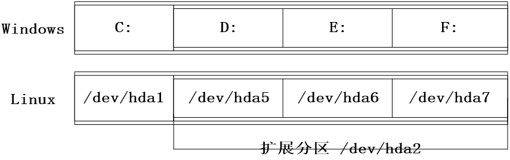
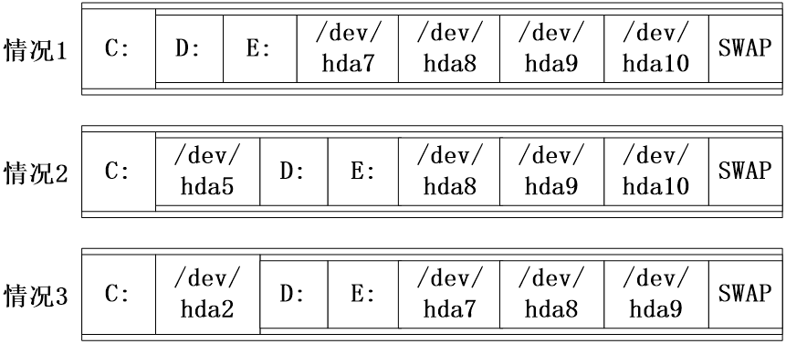
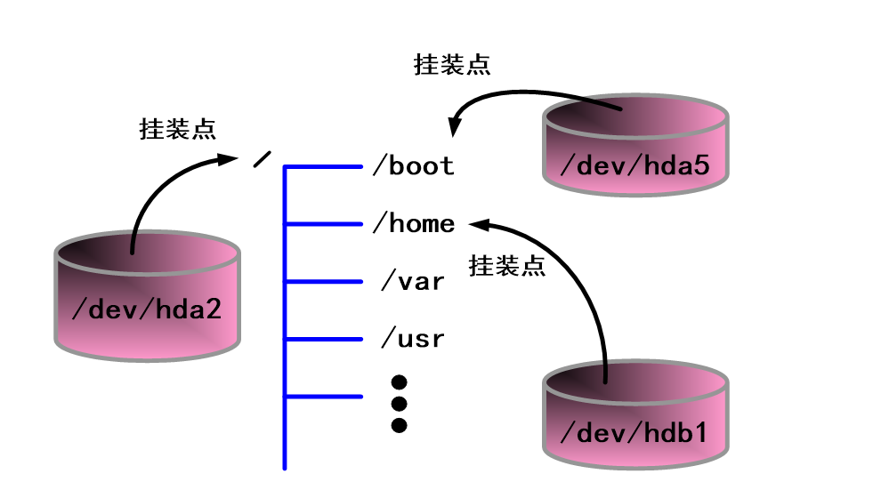
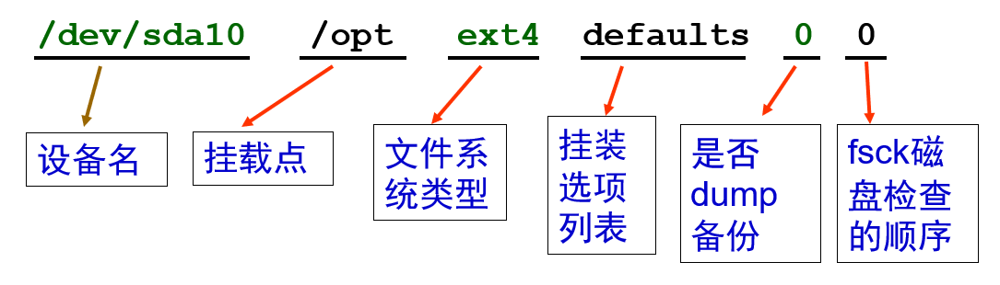
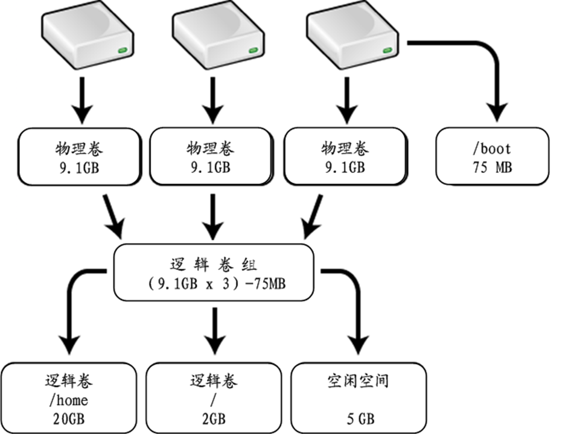

# 磁盘分区和 LVM

## 学习内容

- Linux 磁盘分区的基本知识
- 学会使用磁盘分区工具 fdisk
- 学会创建文件系统和挂装
- 理解静态分区的缺点以及 LVM 的优势
- 掌握 LVM 的相关术语以及逻辑结构
- LVM 系统的创建
- 学会扩展和缩减卷组以及逻辑卷

## 磁盘的两种分区管理方式

静态硬盘分区：通过静态分区管理，首先需要在磁盘上创建主分区、扩展分区和逻辑分区，然后对这些分区进行管理。

动态硬盘分区 LVM：在动态磁盘上存储数据，首先需要在磁盘上创建动态的卷组和逻辑卷，然后对这些卷进行管理。

### 磁盘分区的设备名

在 Linux 当中我们通过设备名来访问设备。Linux 下的所有设备名存放在 /dev 目录中。


### Linux 中分区的设备名

| 分区                                       | 分区设备名 |
| ------------------------------------------ | ---------- |
| IDE 第 1 个硬盘（master）的第 1 个主分区   | /dev/hda1  |
| IDE 第 1 个硬盘（master）的第 2 个主分区   | /dev/hda2  |
| IDE 第 1 个硬盘（master）的第 3 个主分区   | /dev/hda3  |
| IDE 第 1 个硬盘（master）的第 4 个主分区   | /dev/hda4  |
| IDE 第 1 个硬盘（master）的第 1 个逻辑分区 | /dev/hda5  |
| IDE 第 1 个硬盘（master）的第 2 个逻辑分区 | /dev/hda6  |
| …………                                       | …          |
| IDE 第 2 个硬盘（slave）的第 1 个主分区    | /dev/hdb1  |
| IDE 第 2 个硬盘（slave）的第 2 个主分区    | /dev/hdb2  |
| …………                                       | …          |
| SCSI 第 1 个硬盘的第 1 个主分区            | /dev/sda1  |
| SCSI 第 1 个硬盘的第 2 个主分区            | /dev/sda2  |
| …………                                       | …          |

### 关于磁盘分区设备的说明

- 与 Windows 系统不同，Linux 环境下没有盘符的概念。我们需要通过设备名对磁盘进行相应的操作。
- IDE 接口硬盘的设备名均以 /dev/hd 开头；SCSI/SAS/SATA/USB 接口硬盘的设备名均以 /dev/sd 开头。
- 数字 1\~4 留给主分区或扩展分区使用，逻辑分区编号从 5 开始。只能有一个扩展分区。

### Linux 与 Windows 分区对比



### Linux 与 Windows 系统共存的磁盘分区情况



### Linux 如何使用分区



在 Linux 操作系统中没有 Windows 所谓磁盘分区概念，而是将每个分区当成目录使用，此指定的目录即称为挂载点（mount point）

## 磁盘分区工具

### fdisk（磁盘分区工具）命令详解

fdisk 是 Linux 下的一个命令式磁盘分区工具。

格式：`fdisk <硬盘设备名>`

选项：

| 子命令 | 说明                         |
| ------ | ---------------------------- |
| a      | 调整硬盘的启动分区           |
| d      | 删除一个硬盘分区             |
| l      | 列出所有支持的分区类型       |
| m      | 列出所有命令                 |
| n      | 创建一个新的分区             |
| p      | 列出硬盘分区表               |
| q      | 退出 fdisk，不保存更改       |
| t      | 更改分区类型                 |
| u      | 切换所显示的分区大小的单位   |
| w      | 把设置写入硬盘分区表之后退出 |

如：

```bash
# 在命令行方式下显示指定硬盘的分区表信息
fdisk -l <硬盘设备名>
```

注意分区结束之后，使用 partprobe 命令重新读取分区表。

### mkfs（创建文件系统）命令详解

格式：`$ mkfs -t <fstype> -c <分区设备名>`

其中：

- `-t fstype`：指定文件系统类型
- `-c`：建立文件系统前先检测有无坏块

如：

```bash
$ mkfs -t ext4 -c /dev/hda2 # 创建 Linux 原生格式的文件系统
# 事实上一般文件系统都没有坏块，因此 -c 很多时候可以不加
$ mkfs -t vfat /dev/hdb2 # 创建 Windows 原生格式的文件系统
$ mkfs.ext4 /dev/sda1
```

### mount（挂装文件系统）命令详解

功能：挂装文件系统

格式：`mount [选项] [<分区设备名>] [<挂装点>]`

常用选项：

- `-t <文件系统类型>`：指定文件系统类型
- `-r`：使用只读方式来挂载
- `-a`：挂装 /etc/fstab 文件中记录的设备
- `-o iocharset=cp936`：使挂装的设备可以显示中文文件名
- `-o loop`：使用回送设备挂装 ISO 文件和映像文件

我们一般使用 `df -h` 检查挂装情况。

### unmount（卸载文件系统）命令详解

命令格式：`$ umount <分区设备名或挂装点>`

如：

```bash
umount /dev/hda6
umount /dev/sdb1
umount /opt
```

### 挂装/卸装 文件系统的注意事项

- 挂装点目录必须存在；
- 应该在挂装目录的上级目录下进行挂装操作；
- 不能在同一个挂装点目录下挂装两个文件系统；
- 当文件系统处于“busy”状态时不能进行卸装。

文件系统处于“busy”状态的 3 种情况：

- 文件系统上面有打开的文件
- 有进程正在使用此文件系统上
- 文件系统上面的缓存文件正在被使用

### fuser 命令详解

fuser 命令可以根据文件（目录、设备）查找使用它的进程，同时也提供了杀死这些进程的方法。 如：

```bash
# 查看挂装点有哪些进程需要杀掉
$ fuser -cu /mount_point
# 杀死这些进程（向其发送[SIGKILL, 9]信号）
$ fuser -ck /mount_point
# 卸载挂接点上的设备
$ umount /mount_point
```

### 系统启动时自动挂装文件系统

想要系统启动时自动挂装文件系统，则需要修改 /etc/fstab。

qfstab (file system table) 是一个纯文本文件，开机后，系统会自动搜索该文件中的内容，对列于该文件中的文件系统进行自动挂载。

> 由于文件系统的自动挂装是开机后自动挂装的，所以在执行时需要仔细检查命令是否标准，如空格、TAB 、dev 单词错误等细节，避免开机错误卡死。
>
> 使用 `mount -a` 命令可以立即挂载 /etc/fstab 中的所有文件系统，也方便检查修改的文件是否有问题。
>
> 利用虚拟机本身的备份功能能有效地避免灾难（确信）

/etc/fstab 文件的格式信息：

1. 每一行说明一个文件系统的挂载信息
2. 每一行由 6 列信息组成，列与列之间用 TAB 键隔开，一般格式如下：



### 挂装选项

| 选项          | 说明                                                                                          |
| ------------- | --------------------------------------------------------------------------------------------- |
| defaults      | 使用 rw, suid, dev, exec, auto, nouser 和 async 挂装设备                                      |
| acl/noacl     | 支持/不支持 POSIX Access Control Lists（ACL）                                                 |
| async/sync    | 以同步/非同步方式，执行文件系统的输入输出操作                                                 |
| atime/noatime | 每次访问文件时都 更新/不更新 文件的访问时间，atime 为默认值，noatime 会提高文件系统的访问速度 |
| auto/noauto   | 使用 mount -a 或开机时会不会自动挂装                                                          |
| dev/nodev     | 可不可以解读文件系统上的字符或区块特殊设备                                                    |
| exec/noexec   | 可以/不可以 执行文件系统上的二进制文件                                                        |
| suid/nosuid   | 开启/禁用 SUID 和 SGID 设置位                                                                 |
| user/nouser   | 允许普通用户/仅超级用户来挂装此文件系统，若无显示定义，隐含启用 noexec,nosuid,nodev 参数      |
| rw/ro         | 以读写/只读方式挂装文件系统                                                                   |

### 静态分区的缺点

在安装 Linux 的过程中如何正确地评估各分区大小是一个难题，因为系统管理员不但要考虑到当前某个分区需要的容量，还要预见该分区以后可能需要的容量的最大值。

当某个分区空间耗尽时，通常的解决方法是：

1. 使用符号链接（但会破坏 Linux 文件系统的标准结构）
2. 备份整个系统，清除硬盘，重新对硬盘分区，然后恢复数据到新分区（需要停机一段时间进行恢复操作）
3. 使用调整分区大小的工具，如 Patition Magic 等（需要停机一段时间进行调整）

## LVM 相关术语

### 基本概念

LVM 是逻辑卷管理（Logical Volume Manager）的简称，它是 Linux 环境下对卷进行操作的抽象层，为文件系统屏蔽下层磁盘分区物理布局，从而提高磁盘分区管理的灵活性。

通过 LVM 系统管理员可以轻松管理磁盘分区，如：将若干个磁盘分区连接为一个整块的卷组（volume group），形成一个存储池。

管理员可以在卷组上随意创建逻辑卷组（logical volumes），并进一步在逻辑卷上创建文件系统。同样的，管理员也可以 通过 LVM 可以方便的调整卷组的大小，并可以对逻辑卷的大小进行调整。

### 物理卷

物理卷（physical volume, PV）在 LVM 系统中处于最底层。

物理卷可以是整个硬盘，硬盘上的分区，或者是从逻辑上与磁盘分区具有同样功能的设备（如：RAID）。

物理卷是 LVM 的基本存储逻辑块，但和基本的物理存储介质（如分区、硬盘等）比较，却包含有与 LVM 相关的管理参数。

### 物理区域

每一个物理卷被划分为基本单元（称为 Physical Extent, PE），具有唯一编号的 PE 是可以被 LVM 寻址的最小存储单元。

PE 的大小可根据实际情况在创建物理卷时指定，默认为 4MB。而 PE 的大小一旦确定将不能改变，同一个卷组中的所有物理卷的 PE 的大小需要保持一致。

### 卷组

卷组（Volume Group, VG）建立在物理卷之上，它由一个或多个物理卷组成。

- 卷组创建好后，可以直接添加物理卷到卷组中。在卷组上可以创建一个或多个 LVM 分区”（逻辑卷）；
- 一个 LVM 系统中可以只有一个卷组，也可以包含多个卷组。

LVM 的卷组可以看成非 LVM 系统中的物理磁盘。

### 逻辑卷

逻辑卷（Logical Volume, LV）建立在卷组之上，是从卷组中“切出”的一块空间。

逻辑卷创建之后，其大小可以按需伸缩。

LVM 的逻辑卷可以看成非 LVM 系统中的硬盘分区，在逻辑卷之上可以建立文件系统。

### 逻辑区域

逻辑卷也被划分为可被寻址的基本单位（称为 Logical Extent, LE）。

在同一个卷组中，LE 的大小和 PE 是相同的，并且一一对应。

## LVM 的创建

### LVM 组织结构



### PV-VG-LV 的设备名

| 名称 | 含义                    | 设备名                    |
| ---- | ----------------------- | ------------------------- |
| PV   | 物理卷：磁盘或分区      | `/dev/sda?`               |
| VG   | 卷组：一组磁盘和/或分区 | `/dev/<VGname>/(目录)`    |
| LV   | 逻辑卷：LVM 分区        | `/dev/<VG name>/<LVname>` |

### 创建 LVM 系统的步骤

创建 LVM 系统的步骤如下：

- 创建 LVM 类型的分区
- 在新硬盘或分区上创建物理卷
- 将新创建的物理卷添加到卷组
- 在卷组中创建逻辑卷
- 在逻辑卷中创建文件系统
- 挂装创建的文件系统

## LVM 管理工具的使用

### 创建 LVM 的相关命令

```bash
# 转换分区类型（就是之前的步骤）
$ fdisk ...
# 创建物理卷
$ pvcreate <磁盘或分区设备名>
# 创建卷组
$ vgcreate <卷组名> <物理卷设备名> [...]
# 创建逻辑卷
$ lvcreate -L <逻辑卷大小> -n <逻辑卷名> <卷组名>
$ lvcreate -l <PE值> -n <逻辑卷名> <卷组名>
# 其中 PE 值可以通过使用命令 vgdisplay|grep "Free PE" 获得。一般用于精确分配所有剩下的空间
```

如：

```bash
# 创建两个物理卷
$ pvcreate /dev/sdb{1,5}
# 用已创建的2个物理卷创建名为 wwwVG 的卷组
$ vgcreate wwwVG /dev/sdb1 /dev/sdb5
# 在 wwwVG 卷组中创建大小为2GB，名字为 www 的逻辑卷
$ lvcreate -L 2G -n www wwwVG
```

### 查看卷信息

```bash
# 查看物理卷
$ pvdisplay [<物理卷设备名>]
# 查看卷组
$ vgdisplay [<卷组名>]
# 查看逻辑卷
$ lvdisplay [<逻辑卷卷设备名>]
```

### 扩展逻辑卷

若卷组中无剩余空间，则首先需要扩展卷组：

- 添加硬盘，在磁盘上创建 8e 类型的分区
- 在分区上创建物理卷
- 将物理卷添加到卷组中

```bash
$ vgextend <卷组名> <物理卷设备名> [...]
# 若卷组中有剩余空间，扩展卷组中的逻辑卷
$ lvextend -L <+逻辑卷增量> <逻辑卷设备名称>
$ lvextend -l <+PE值>  <逻辑卷设备名称>
# 对已扩展的逻辑卷中的文件系统进行容量扩展
$ resize2fs <分区或逻辑卷设备名>
```

如：

```bash
# 将两个物理卷扩展到已存在的VolGroup00卷组中
$ vgextend VolGroup00 /dev/sdb1 /dev/sdb2
# 在VolGroup00卷组中扩展LogVolHome逻辑卷，扩展大小为6GB
$ lvextend -L +6G /dev/VolGroup00/LogVolHome
# 为home文件系统（ext4）扩充容量
$ resize2fs -f /dev/VolGroup00/LogVolHome
```

### 缩减逻辑卷

- 使用 umount 命令卸载文件系统
- 使用 e2fsck 命令检查文件系统
- 使用 resize2fs 命令缩减文件系统容量

```bash
resize2fs /dev/……..  3G
# 缩减逻辑卷
lvreduce -L < -逻辑卷增量> <逻辑卷设备名称>
lvreduce -l < -PE值>  <逻辑卷设备名称>
```

### LVM 常用命令集

| **任务** | **PV**    | **VG**    | **LV**    |
| -------- | --------- | --------- | --------- |
| 创建     | pvcreate  | vgcreate  | lvcreate  |
| 删除     | pvremove  | vgremove  | lvremove  |
| 扫描列表 | pvscan    | vgscan    | lvscan    |
| 显示属性 | pvdisplay | vgdisplay | lvdisplay |
| 扩展     |           | vgextend  | lvextend  |
| 缩减     |           | vgreduce  | lvreduce  |

> - 可以使用 lvm help 命令显示上述命令的功能。
> - 可以使用命令参数-h 查看每个命令的使用方法，如：`# lvreduce -h`
