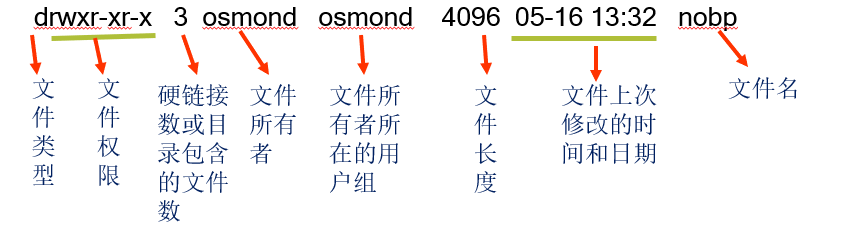
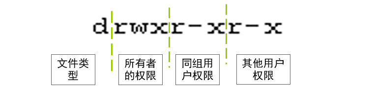
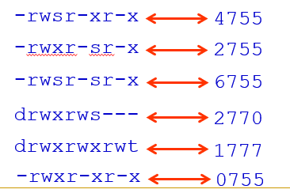

# 账户管理和权限管理

## 内容要点

- 账户实质
- 账户文件
- 账户设置
- 口令管理
- 权限表示
- 权限设置

### 学习目标

- 熟悉账户配置文件
- 学会设置和管理口令
- 理解 Linux 系统的权限
- 掌握设置基本操作权限
- 学会设置特殊权限
- 学会设置 ext2/3 的文件扩展属性
- 学会设置 FACL 权限

## 账户管理的相关概念

### 账户实质

> 账户实质上就是一个用户在系统上的标识

系统依据账户来区分每个用户的文件、进程、任务，给每个用户提供特定的工作环境（如用户的工作目录、shell 版本、以及 X-Window 环境的配置等），使每个用户的工作都能独立不受干扰地进行。

Linux 中的账户包括：

- 用户账户
- 组账户

### 用户

Linux 系统下的用户账户（简称用户）有两种：

- 普通用户账户：在系统上的任务是进行普通工作
- 超级用户账户（或管理员账户）：在系统上的任务是对普通用户和整个系统进行管理。

但不管是哪种用户，都被分配了一个唯一的用户 ID 号（UID）。其中：

- 超级用户：UID = 0，GID = 0
- 普通用户：UID >= 500
- 系统用户（伪用户，不可登录）：0 < UID < 500

用户名和 UID 被保存在 `/etc/passwd` 这个文件中。当一个用户登录时，他们被分配了一个主目录和一个运行的程序（通常是 shell）。若无适当权限，用户无法读取、写入或执行彼此的文件。

### 组

组是用户的集合。

每个组都被分配了一个唯一的组 ID 号（GID），且组和 GID 被保存在 `/etc/group` 文件中。

每个用户都有他们自己的私有组，也都可以被添加到其他组中来获得额外的存取权限。而且组中的所有用户都可以共享属于该组的文件。

与用户一样，组也有多种类型，包括标准组和私有组。

- 标准组：标准组可以容纳多个用户。

  若使用标准组，在创建一个新的用户时就应该指定他所属于的组。

- 私有组：私有组中只有用户自己

  当在创建一个新用户时， 若没有指定他所属于的组，系统就会建立一个和该用户同名的私有组，且用户也会被分配到这个私有组中。

  - 优点：防止新文件归 “公共” 组所有；
  - 缺点：可能会鼓励创建 “任何人都可以访问” 的文件。

### 用户和组的关系

1. 组是用户的集合。
2. 一个标准组可以容纳多个用户。
3. 同一个用户可以同属于多个组，这些组可以是私有组，也可以是标准组。

当一个用户同属于多个组时，将这些组分为：

- 主组（初始组）：用户登录系统时的组。
- 附加组：可切换的其他组。

### Shadow password

下面以 Red Hat 的账户管理为例。

特点：

- 默认启用 shadow passwords 功能：
  - /etc/passwd 文件对任何用户均可读，但为了增加系统的安全性， 用户的口令通常用 shadow passwords 保护。
  - 经过 shadow passwords 保护的账户密码和相关设置信息保存在 /etc/shadow 文件里。 /etc/shadow 只对 root 用户可读。
  - 默认使用 MD5 算法的用户口令。
- 一般不会设置组口令。因为绝大多数应用程序不使用组口令。所以建议尽量使用私有组来提高系统安全性。
- 管理工具由 shadow-utils 软件包提供。同时不建议管理员直接编辑修改系统账户文件来维护账户。

账户验证信息文件：

| 名称         | 存储位置     | 文件权限   |
| ------------ | ------------ | ---------- |
| 口令文件     | /etc/passwd  | -rw-r--r-- |
| 影子口令文件 | /etc/shadow  | -r-------- |
| 组账号文件   | /etc/group   | -rw-r--r-- |
| 组口令文件   | /etc/gshadow | -r-------- |

#### 口令文件 /etc/passwd

每一个用户一条记录。而每条记录由用冒号间隔的七个字段组成：

| 字段        | 说明                                                                                              |
| ----------- | ------------------------------------------------------------------------------------------------- |
| name        | 用户名                                                                                            |
| password    | 在此文件中的口令是 X，这表示用户的口令是被 /etc/shadow 文件保护的                                 |
| uid         | 用户的识别号，是一个数字。每个用户的 UID 都是唯一的                                               |
| gid         | 用户的组的识别号，也是一个数字。每个用户账户在建立好后都会有一个主组。主组相同的账户其 GID 相同。 |
| description | 用户的个人资料，包括地址、电话等信息                                                              |
| home        | 用户的主目录，通常在 /home 下，目录名和账户名相同                                                 |
| shell       | 用户登录后启动的 shell，默认是 /bin/bash                                                          |

#### 影子口令文件 /etc/shadow

每一个用户一条记录。且每条记录由用冒号间隔的九个字段组成：

| 字段               | 说明                                                 |
| ------------------ | ---------------------------------------------------- |
| 用户名             | 用户登录名                                           |
| 口令               | 用户的密码，是加密过的（MD5）                        |
| 最后一次修改的时间 | 从 1970 年 1 月 1 日起，到用户最后一次更改密码的天数 |
| 最小时间间隔       | 从 1970 年 1 月 1 日起，到用户应该更改密码的天数     |
| 最大时间间隔       | 从 1970 年 1 月 1 日起，到用户必须更改密码的天数     |
| 警告时间           | 在用户密码过期之前多少天提醒用户更新                 |
| 不活动时间         | 在用户密码过期之后到禁用账户的天数                   |
| 失效时间           | 从 1970 年 1 月 1 日起，到账户被禁用的天数           |
| 标志               | 保留位                                               |

#### 组账号文件 /etc/group

每一个组一条记录。每条记录由用冒号间隔的四个字段组成：

| 字段         | 说明                                                      |
| ------------ | --------------------------------------------------------- |
| 组名         | 这是用户登录系统时的默认组名，它在系统中是唯一的          |
| 口令         | 组口令，由于安全性原因，已不使用该字段保存口令，用“x”占位 |
| 组 ID        | 是一个整数，系统内部用它来标识组                          |
| 组内用户列表 | 属于该组的所有用户名表，列表中多个用户间用“,”分隔         |

#### 组口令文件 /etc/gshadow

每一个组一条记录。每条记录由用冒号间隔的四个字段组成：

| 字段           | 说明                                              |
| -------------- | ------------------------------------------------- |
| 组名           | 组名称，该字段与 group 文件中的组名称对应         |
| 加密的组口令   | 用于保存已加密的口令                              |
| 组的管理员账号 | 管理员有权对该组添加删除账号                      |
| 组内用户列表   | 属于该组的用户成员列表，列表中多个用户间用“,”分隔 |

### 验证账号文件的一致性

Red Hat 不建议管理员直接编辑修改系统账户文件来维护账户。但若用户直接编辑了账户文件， 建议使用账号文件的一致性检测命令：

- 命令 `pwck` ：验证用户账号文件，认证信息的完整性。

  该命令检测文件 /etc/passwd 和 /etc/shadow 的每行中字段的格式和值是否正确。

- 命令 `grpck`：验证组账号文件，认证信息的完整性。

  该命令检测文件 /etc/group 和 /etc/gshadow 的每行中字段的格式和值是否正确。

### 用户默认环境配置及模板

用户默认配置文件：

- /etc/login.defs
- /etc/default/useradd

新用户基本信息：

- /etc/skel

如果手工创建用户，则需复制该目录到用户主目录。

## 用户和组管理

用户管理：

- useradd
- usermod
- userdel

组管理：

- groupadd
- groupmod
- groupdel

### 用户管理

#### 添加用户账号（useradd）

格式：`useradd [<选项>] <用户名>`

常用选项：

- `-g group`：指定新用户的主（私有）组。
- `-G group`：指定新用户的附加组。
- `-d directory`：指定新用户的自家目录。
- `-s shell`：定新用户使用的 Shell，默认为 bash。
- `-e expire`：指定用户的登录失效时间，例如：08/10/2001
- `-M`：不建立新用户的自家目录。

useradd 命令添加用户过程：

1. 编辑账户验证信息文件
   - /etc/passwd, /etc/shadow
   - /etc/group, /etc/gshadow
2. 创建主目录 `/home/<username>`：

   根据骨架目录（Skeleton Directory）的模板文件，即 /etc/skel/ 的内容填充用户主目录

3. 设置权限和拥有者

#### 设置用户口令（passwd）

命令格式：`passwd［＜用户账号名＞]`

如：

```bash
# 设置用户自己的口令
passwd
# root用户设置他人的口令
passwd user1

# 例一：
useradd -g group1 -e 12/31/2011 user1
passwd user1

# 例二：
useradd -G staff tom
passwd tom

# 例三：
useradd -G ftpgrp -d /var/ftp2 -s /sbin/nologin -M ftp1
passwd ftp1
```

显示 useradd 命令参数的默认值：

- 使用命令 `useradd -D`
- 从文件 /etc/default/useradd 中读取

更改 useradd 命令参数的默认值：

- 格式：`useradd -D [-g group] [-b base] [-s shell] [-e expire]`
- 如：

```bash
useradd -D -s /bin/ksh
```

#### 修改用户账号（usermod 命令）

格式：`usermod 用户帐号 <参数>`

参数：

- `-c <备注>`：修改用户帐号的备注文字。
- `-d 登入目录>`：修改用户登入时的目录。
- `-e <有效期限>`：修改帐号的有效期限。
- `-f <缓冲天数>`：修改在密码过期后多少天即关闭该帐号。
- `-g <群组>`：修改用户所属的群组。
- `-G <群组>`：修改用户所属的附加群组。
- `-l <帐号名称>`：修改用户帐号名称。
- `-L`：锁定用户密码，使密码无效。
- `-s <shell>`：修改用户登入后所使用的 shell。
- `-u <uid>`：修改用户 ID。
- `-U`：解除密码锁定。

如：

```bash
# 1、将 newuser2 添加到组 staff 中
usermod -G staff newuser2
# 2、修改 newuser 的用户名为 newuser1
usermod -l newuser1 newuser
# 3、锁定账号 newuser1
usermod -L newuser1
# 4、解除对 newuser1 的锁定
usermod -U newuser1
```

#### 删除用户账号（userdel）

格式：`userdel [<-r>] <用户名>` 选项：

- \-r：用于删除用户的宿主目录

如：

```bash
userdel ftp1
userdel –r user1
```

### 组管理

#### 添加组账号（groupadd 命令）

格式：`groupadd [<参数>] <组账号名>` 参数：

- \-r：用于创建系统组账号（GID 小于 500 ）
- \-g：用于指定 GID

如：

```bash
groupadd mygroup
groupadd -r sysgroup
groupadd -g 888 group2
```

#### 修改组账号（groupmod 命令）

格式：`groupmod [<参数>] <组账号名>`

参数：

- \-g：改变组账号的 GID ，组账号名保持不变。
- \-n：改变组账号名。

如：

```bash
groupmod -g 503 mygroup
groupmod –n newgroup mygroup
```

#### 删除组账号（groupdel 命令）

格式：`groupdel <组账号名>` 如：

```bash
groupdel mygroup
```

注意：

- 被删除的组账号必须存在
- 当有用户使用组账号作为私有组时不能删除
- 与用户名同名的私有组账号在使用 userdel 命令删除用户时被同时删除，无需使用 groupdel 命令

### 组成员管理

向标准组中添加用户：

- `gpasswd -a <用户账号名> <组账号名>`
- `usermod -G <组账号名> <用户账号名>`

```bash
gpasswd -a user1 staff
usermod -G staff user1
```

xxxxxxxxxx10 1# 查看指定用户或组的 quota 设置 2quota \[-vl] \[-u ] 3quota \[-vl] \[-g ] 4quota -q5​6# 显示文件系统的磁盘限额汇总信息 7# 显示指定文件系统的磁盘限额汇总信息 8repquota \[-ugv] filesystem... 9# 显示所有文件系统的磁盘限额汇总信息 10repquota \[-auv] bash

```bash
gpasswd -d user1 staff
```

## 批量用户管理

### 批量用户管理工具

成批添加／更新一组账户：newusers 成批更新用户的口令：chpasswd 批量生成安全的口令：pwgen 或 secpwgen（由 RPMForge 仓库提供）

### newusers 命令

格式：`newusers <filename>`

> filename 的格式与 /etc/passwd 一致

如：

```bash
vi userfile.txt
cat userfile.txt
# user1:x:1001:1001::/home/user1:/bin/bash
# user2:x:1002:1002::/home/user2:/bin/bash
# ftpuser1:x:2001:2001::/home/ftpuser1:/sbin/nologin
# ftpuser2:x:2002:2002::/home/ftpuser2:/sbin/nologin
newusers userfile.txt
```

### chpasswd 命令

格式：`chpasswd <filename>`

其中 filename 每一行的格式：`username:password`

而 username 必须是系统上已存在的用户

如：

```bash
vi userpwdfile.txt
chmod 600 userpwdfile.txt
cat userpwdfile.txt
# user1:123456
# user2:passwd
# ftpuser1:123qaz
# ftpuser2:xsw321

# 或者直接使用管道连接
cat userpwdfile.txt | chpasswd
```

### pwgen 命令

格式：`pwgen [选项] [口令长度] [口令个数]`

默认的口令长度为 8；默认生成的口令个数为 160 个。

选项：

- `-c`：至少包含一个大写字母
- `-n`：至少包含一个数字
- `-y`：至少包含一个非字母和数字的特殊字符
- `-s`：生成完全随机的安全口令
- `-1`：每行只显示一个口令，使用该参数通常不省略 `[口令长度] [口令个数]`。如果省略 `[口令长度] [口令个数]` 就只生成一个口令。

如：

```bash
pwgen
pwgen  8 20
pwgen -1 8 20

pwgen -y
pwgen -sy
pwgen -ns 10
pwgen -nsy 12 20
pwgen -nsy1 12 20
```

使用 pwgen 命令生成 chpasswd 命令所需的口令文件：

```bash
cat userfile.txt
# user1:x:1001:1001::/home/user1:/bin/bash
# user2:x:1002:1002::/home/user2:/bin/bash
# ...

cut -d \: -f 1 userfile.txt > pwdtemp1
# 或者使用：
cut -d ":" -f 1 userfile.txt > pwdtemp1

pwgen -cn1 10 $(wc -l < userfile.txt) > pwdtemp2
# wc命令用于获取文本文件中的文本行数。命令亦可写作：
pwgen -cn1 10 `wc -l < userfile.txt` > pwdtemp2

# 文本拼接
paste -d “:” pwdtemp1 pwdtemp2 > userpwd.txt

# 设置密码
cat userpwdfile.txt | chpasswd
```

## 口令维护和口令时效

### 口令维护

即禁用、恢复和删除用户口令。

如：

```bash
# 禁用用户账户口令
passwd -l <用户账号名>
# 查看用户账户口令状态
passwd -S <用户账号名>
# 恢复用户账户口令
passwd -u <用户账号名>
# 清除用户账户口令
passwd -d <用户账号名>
```

### 口令时效

口令时效是系统管理员用来防止机构内不良口令的一种技术。

防止口令被攻击的方法就是要经常地改变口令；而强制用户在一段时间之后更改口令的机制称为口令时效。

在默认状况下，口令不会过期。但事实上，强制口令失效是强大安全策略的一部分。

### 设置新添用户的口令时效

修改 /etc/login.defs 的相关配置参数：

| 参数          | 配置解释                                                                                                                         |
| ------------- | -------------------------------------------------------------------------------------------------------------------------------- |
| PASS_MAX_DAYS | 设定在多少天后要求用户修改口令。默认口令时效的天数为 99999，即关闭了口令时效。明智的设定一般是 60 天（2 个月）强制更改一次口令。 |
| PASS_MIN_DAYS | 设定在本次口令修改后，至少要经过多少天后才允许更改口令。                                                                         |
| PASS_MIN_LEN  | 设定口令的最小字符数。                                                                                                           |
| PASS_WARN_AGE | 设定在口令失效前多少天开始通知用户更改口令（一般在用户刚刚登录系统时就会收到警告通知）。                                         |

### 设置已存在用户的口令时效（chage 命令）

格式：`chage [选项] [用户登录名]`

如：

```bash
# 查看用户jason当前的口令时效信息
chage -l jason
# 使用户jason下次登录之后修改口令
chage -d 0 jason
# 用户 jason 两天内不能更改口令，且口令最长的存活期为 30 天，并在口令过期前 5 天通知用户
chage -m 2 -M 30 -W 5 jason
```

### 用户切换命令

1. su -
   - 直接切换为超级用户
   - 普通用户要切换为超级用户必须知道超级用户的口令
   - 适用于系统中只有单个系统管理员的情况
2. sudo
   - 直接使用 sudo 命令前缀执行系统管理命令
   - 执行系统管理命令时无需知道超级用户的口令，使用普通用户自己的口令即可
   - 由于执行系统管理命令时无需知晓超级用户口令，所以适用于系统中有多个系统管理员的情况，因为这样不会泄露超级用户口令。当然系统只有单个系统管理员时也可以使用。

root 账户键入 visudo 即可进入 sudo 配置，或者 `vim /etc/sudoers`。使用 visudo 进行 sudo 配置，将会得到很多提示。

按 yyp 键复制并在粘贴在下一行，在这一行的 root 处将 root 替换为你所需要添加用户的账户名，比如 user1，结果就是：

```text
root   ALL=(ALL)   ALL
user1   ALL=(ALL)   ALL
```

### 账户相关命令

| 命令   | 解释                                                                     |
| ------ | ------------------------------------------------------------------------ |
| id     | 显示用户当前的 uid、gid 和用户所属的组列表                               |
| groups | 显示指定用户所属的组列表                                                 |
| whoami | 显示当前用户的名称                                                       |
| w/who  | 显示登录用户及相关信息                                                   |
| newgrp | 用于转换用户的当前组到指定的组账号，用户必须属于该组才可以正确执行该命令 |

### id 命令

说明：查看账户的 uid 和 gid 及所属分组

格式：`id [-gGnru] [--help] [--version] [用户名称]`

参数：

- `-g` 或 `--group`：显示用户所属群组的 ID。
- `-G` 或 `--groups`：显示用户所属附加群组的 ID。
- `-n` 或 `--name`：显示用户，所属群组或附加群组的名称。
- `-r` 或 `--real`：显示实际 ID。
- `-u` 或 `--user`：显示用户 ID。

说明：id 会显示用户以及所属群组的实际与有效 ID。若两个 ID 相同，则仅显示实际 ID。若仅指定用户名称，则显示目前用户的 ID。

## 文件和目录的基本权限

### 权限概述

Linux 是多用户的操作系统，允许多个用户同时在系统上登录和工作。

为了确保系统和用户的安全采取了如下安全措施：

- 通过 UID/GID 确定每个用户在登录系统后都做了些什么
- 通过 UID/GID 来区别不同用户所建立的文件或目录
- 每个文件或目录都属于一个 UID 和一个 GID
- 每个进程都使用一个 UID 和一个或多个 GID 来运行
- 通常由被运行进程的用户决定
- 超级用户具有一切权限，无需特殊说明
- 普通用户只能不受限制的操作主目录及其子目录下的所有文件，对系统中其他目录/文件的访问受到限制

### 三种基本权限

| 权限     | 描述字符 | 对文件的含义       | 对目录的含义                         |
| -------- | -------- | ------------------ | ------------------------------------ |
| 读权限   | r        | 可以读取文件的内容 | 可以列出目录中的文件列表             |
| 写权限   | w        | 可以修改或删除文件 | 可以在该目录中创建或删除文件或子目录 |
| 执行权限 | x        | 可以执行该文件     | 可以使用 cd 命令进入该目录           |

- 目录上有执行权限（x），表示可以进入该目录或穿越它进入更深层次的子目录。
- 目录上只有执行权限（x），但目录没有读权限（无法访问文件列表），要访问该目录下的有读权限的文件，必须知道文件名才可以访问。
- 目录上只有执行权限（x），不能列出目录列表也不能删除该目录。
- 目录上执行权限和读权限的组合（rx），表示可以进入目录并列出目录列表
- 目录上执行权限和写权限的组合（rwx），表示可以在目录中创建、删除和重命名文件（但不能列出文件列表）。

### 分配三种基本权限

| 文件/目录使用者 | 权限名         | 权限分配（用途）                                 | 权限的优先顺序        |
| --------------- | -------------- | ------------------------------------------------ | --------------------- |
| 属主            | 属主 user      | 限制文件或目录的创建者                           | UID 匹配              |
| 同组人          | 组 group       | 限制文件或目录所属组的成员                       | UID 不匹配但 GID 匹配 |
| 其他人          | 其他用户 other | 限制非属主或所属组的能访问该文件或目录的其他人员 | 都不匹配              |

### 查看文件/目录的权限

通过给三类用户分配三种基本权限，就产生了文件或目录的 9 个基本权限位。如：

```bash
ls -l
# 总计 12
# -rw-rw-r--   1   osmond   family   0   06-16   20:43   abc
# drwxr-xr-x   2   osmond   family   4096   06-16   20:43   docs
# -rw-rw-r--   1   osmond   osmond   1155   06-16   20:44   mylist.txt
# drwxr-xr-x   3   osmond   osmond   4096   05-16   13:32   nobp
```

每一列表示的内容如图：



> 其中 `-` 表示无权限。

### 文件/目录的权限

```bash
ls -l docs
drwxr-xr-x   2   osmond   family   4096   06-16   20:43   docs
```



在显示的结果中，第一个字段的第 2 ～ 10 个字符是用来表示权限。

这 9 个字符每 3 个一组，组成 3 套 权限控制：

- 第一套控制文件所有者的访问权限
- 第二套控制所有者所在用户组的其他成员的访问权限
- 第三套控制系统其他用户的访问权限

### 常见的权限字符串及其含义

| 字符串     | 八进制数值 | 说明                                                                 |
| ---------- | ---------- | -------------------------------------------------------------------- |
| -rw------- | 600        | 只有属主才有读取和写入的权限。                                       |
| -rw-r--r-- | 644        | 只有属主才有读取和写入的权限；同组人和其他人只有读取的权限。         |
| -rwx------ | 700        | 只有属主才有读取、写入、和执行的权限。                               |
| -rwxr-xr-x | 755        | 属主有读取、写入、和执行的权限；同组人和其他人只有读取和执行的权限。 |
| -rwx--x--x | 711        | 属主有读取、写入、和执行权限；同组人和其他人只有执行权限。           |
| -rw-rw-rw- | 666        | 每个人都能够读取和写入文件。                                         |
| -rwxrwxrwx | 777        | 每个人都能够读取、写入、和执行。                                     |
| drwx------ | 700        | 只有属主能在目录中读取、写入。                                       |
| drwxr-xr-x | 755        | 每个人都能够读取目录，但是其中的内容却只能被属主改变。               |

> 每个用户都拥有自己的专属目录（主目录），通常放置在 /home 目录下，这些专属目录的默认权限通常为：`drwx------`

### 与权限相关的命令

- chmod：改变文件或目录的权限
- chown：改变文件或目录的属主（所有者）
- chgrp：改变文件或目录所属的组
- umask：设置文件的缺省生成掩码

### 修改文件/目录的权限（chmod）

用途：更改已有文件或目录的访问权限

命令使用方法：

- 文字设定法：使用字母和操作符表达式来修改或设定文件的访问权限

  格式：`chmod [-R] <文字模式> <文件或目录名>`

- 数值设定法：使用八进制数字来设定文件的访问权限

  格式：`chmod [-R] <八进制模式> <文件或目录名>`

> `-R` 选项表示对目录中的所有文件或子目录进行递归操作。

#### chmod 的文字设定法

格式：`chmod [who] [ + / - / = ] [permission] 文件或目录名`

参数：

- `[who]`：操作对象，包含：
  - u，即属主（user）
  - g，即同组（group）
  - o，即其他（other）
  - a，即所有（all）
- `[ + / - / = ]`：操作符号，包含：
  - \+，添加某权限
  - \-，删除某权限
  - \=，直接赋予某权限并取消其他所有权限
- `[permission]`：访问权限，包含：
  - r，读
  - w，写
  - x，执行
  - \-，无权限

在一个命令行中可给出多个权限模式，其间用逗号间隔。

如：

```bash
chmod u+rw myfile
chmod a+rx,u+w myfile
chmod u+rwx,g+rx,o+rx myfile
chmod a+rwx ,g-w,o-w myfile
chmod a=rwx myfile
chmod go=rx myfile
chmod u-wx,go-x myfile
chmod a+x myfile

chmod +r myfile
# 等价于：chmod a+r myfile
chmod +x myfile
# 等价于：chmod a+x myfile
chmod +w myfile
# 等价于：chmod u+w myfile
chmod =r myfile
# 等价于：chmod a=r myfile
chmod =w myfile
# 等价于：chmod u=w myfile
chmod o= myfile
# 等价于：chmod o=- myfile

chmod u=rw,g=,o= projects
chmod -R u=rwx,go= projects
```

#### chmod 的数字设定法

格式：`chmod n1n2n3 文件或目录名`

使用三个数字模式来表示，分别代表用户（n1）、同组用户（n2）和其它用户（n3）的访问权限。

每个数字模式（n1|n2|n3）由不同权限所对应的数字相加得到一个表示访问权限的八进制数字。

| 权限 | 对应数字 |
| ---- | -------- |
| r    | 4        |
| w    | 2        |
| x    | 1        |
| -    | 0        |

权限转换如：

```bash
-rw-r--r--
# 转换为：644

drwx--x--x
# 转换为：711

drwx------
# 转换为：700

-rwxr-xr-x
# 转换为：755
```

设定代码如：

```bash
# 设定文件 myname.txt 的权限属性为：-rw-r--r--
chmod 644 myname.txt

# 设定文件 myname.txt 的权限属性为：-rwxr-x---
chmod 750 myname.txt

# 设定目录 mydata 的权限属性为：drwx------
chmod 700 mydata/
```

### 改变文件/目录属主或组（chown、chgrp）

- 只有 root 用户才能改变文件的所有者
- 只有 root 用户或所有者才能改变文件所属的组

用 chown 命令改变属主、组，格式为：

`chown [-R] <用户名[<.|:>组名]> <文件｜目录>`

chgrp 被用来改变所属组，格式为：

`chgrp [-R] <组名> <文件｜目录>`

如：

```bash
chown soft myfile
chgrp softgrp myfile
chown .softgrp myfile
chown -R soft mydir
chgrp softgrp mydir
chown -R :softgrp mydir
chown -R soft.softgrp mydir
```

### 设置生成文件/目录时的默认权限

- 创建新文件或新目录时，系统都会为它们指定默认的访问权限，这个缺省的访问权限就由 umask 值来决定。
- 用户可以使用 umask 命令设置文件的默认生成掩码。默认生成掩码告诉系统当创建一个文件或目录时**不应该**赋予其哪些权限。
- 系统不允许用户在创建一个普通文件时就赋予它可执行权限，必须在创建后用 chmod 修改。目录则允许设定可执行权限。

### umask 命令

格式：

查看当前 umask 值：`umask [-S]`

修改当前 umask 值：`umask u1u2u3`

- u1 表示的是不允许属主有的权限
- u2 表示的是不允许同组人有的权限
- u3 表示的是不允许其他人有的权限

RHEL/CentOS 默认的 umask 值：

- 普通用户的 umask 是 002
- root 用户的 umask 是 022

#### umask 值与文件/目录权限

numask 值与新建文件/目录的权限对应表：

| umask 值 | 新建目录的访问权限 | 新建文件的访问权限 |
| -------- | ------------------ | ------------------ |
| 022      | 777 - 022 = 755    | 666 - 022 = 644    |
| 027      | 777 - 027 = 750    | 666 - 027 = 640    |
| 045      | 777 - 045 = 732    | 666 - 045 = 622    |
| 006      | 777 - 006 = 771    | 666 - 006 = 660    |
| 007      | 777 - 007 = 770    | 666 - 007 = 660    |

对于文件：如果 umask 的部分位或全部位为奇数，那么，在对应为奇数的文件权限位计算结果分别再加 1 就是最终文件权限值。

#### 设置 umask 值的方法

- 使用 umask 命令临时设置
- 在 Shell 环境配置文件中设置（RHEL/CentOS 默认在 /etc/bashrc 中设置）
- 在 \~/.bashrc 中重新设置：

  在 /etc/fstab 的文件系统挂装参数中指定

如：

```bash
# 在 /etc/fstab 的挂装选项中加入 umask 值
/dev/sda10  /home  ext3  noauto,umask=022,iocharset=cp936,ro,users  0 0
```

## 三种特殊权限

可执行文件的特殊权限：

- suid：使用命令的所属用户的权限来运行，而不是命令执行者的权限
- sgid：使用命令的组权限来运行

目录的特殊权限：

- sgid：在设置了 sgid 权限的目录中创建的文件会具备该目录的组权限
- sticky-bit：在带有粘滞位的目录中的文件只能被文件的所属用户和 root 用户删除，不管该目录的写入权限是如何设置的

### 特殊权限的文字表示方法

SUID 和 SGID 用 s 表示；Sticky-bit 用 t 表示。

- SUID：占用属主的 x 位置来表示
- SGID：占用组的 x 位置来表示
- sticky-bit：占用其他人的 x 位置来表示

如：

```bash
-rwsr-xr-x 1 root root  23420  2010-08-11  /usr/bin/passwd
-rwxr-sr-x 1 root tty   11084  03-10 21:28 /usr/bin/write
-rwsr-sr-x 1 root root  315416 2010-01-06  /usr/bin/crontab
drwxrws--- 3 root admin 4096   06-18 01:01 /admin/sales
drwxrwxrwt 5 root root  4096   06-18 01:01 /tmp
```

### 特殊权限的数值表示方法

格式：`chmod n0n1n2n3 文件或目录名`

使用一个单独的数字模式（n0）由不同权限所对应的数字相加得到一个表示特殊权限的八进制数。

| 权限       | 对应数字 |
| ---------- | -------- |
| SUID       | 4        |
| SGID       | 2        |
| Sticky-bit | 1        |
| -          | 0        |



如：

```bash
# 为程序 ~/bin/myapp 添加 SUID权限
chmod u+s ~/bin/myapp
chmod 4755 ~/bin/myapp
# 为目录 /home/groupspace 添加 SGID权限
chmod g+s /home/groupspace
chmod 2755 /home/groupspace
# 为目录 /home/share 添加 sticky-bit 权限
chmod o+t /home/share
chmod 1755 /home/share
```

## POSIX 文件访问控制列表

### 文件访问控制列表简介

IEEE POSIX 1003.1e 制定了 ACL 标准。

FACL 是访问控制列表（File Access Control Lists）的缩写，简称 ACL。ACL 给予用户和管理员更灵活的控制文件读写和权限赋予的能力。

- ACL 是标准 UNIX 文件属性（r, w）的附加扩展。
- ACL 可以针对任意指定的用户/组分配 RWX 权限。
- ACL 允许用户共享文件避免使用冒险的 777 权限。

支持 FACL 的操作系统：

- 主流的商业 UNIX 系统
- FreeBSD、Linux 系统

### Linux 的 FACL 支持

ACL 需要内核和文件系统的同时支持。Linux 从 2.6 内核开始提供了对 EXT2/EXT3, JFS, XFS, ReiserFS 等文件系统的 ACL 支持。

ACL 的文件系统支持：

```bash
# 通过文件系统的挂装选项实现 ACL 支持
mount -t ext4 -o acl <device name> <partition>

# 或修改 /etc/fstab 的挂装选项
# 查看ext4文件系统的默认选项
tune2fs -l <device name> <partition> | grep options
# Default mount options: user_xattr acl
# 在RHEL/Fedora/CentOS中，ACL是默认(defaults)挂装选项
```

### ACL 类型

存取 ACL（access ACLs）：是对指定文件或目录的存取控制列表。 默认 ACL（default ACLs）：

- 只能和目录相关。
- 若目录中的文件没有存取 ACL，就会使用该目录的默认 ACL。但是访问 ACL 的优先级更高。
- 默认 ACL 是可选的。

### ACL 工具

在 RHEL/CentOS 中由 acl 软件包提供。

- getfacl：获取文件的 FACL 信息

格式：`getfacl <file|directory>`

- setfacl：设置文件的 FACL 信息

自动获得 ACL 权限：

- 若目录已设置了默认 ACL，则新创建的文件将从其目录继承默认 ACL 设置。
- 使用 mv 命令和 cp -p 命令操作文件时将保持 ACL 设置。

### setfacl 命令

格式：`setfacl [-R] {-m|-x} <rules> <files or directory>`

说明：

- \-R 选项用于对目录进行递归操作
- \-m 选项表示修改 ACL 权限
- \-x 选项表示删除 ACL 权限
- rules 为要设置的 ACL 规则

setfacl 命令中的 ACL 规则：

- `[d:]u:uid:perms`：为指定的用户（使用 UID 或用户名）设置 ACL 权限
- `[d:]g:gid:perms`：为指定的组（使用 GID 或组名）设置 ACL 权限
- `[d:]o:[:]perms`：为其他用户设置 ACL 权限
- `[d:]m:[:]perms`：设置有效的访问掩码

> - 当使用 d:前缀时用于设置默认 ACL，当使用 d:前缀时只能对目录设置
> - perms 为 r、w、x、-或其组合

如：

```bash
setfacl -m u:gandolf:rwx file|directory
setfacl -m g:nazgul:rw file|directory
setfacl -m d:u:frodo:rw directory
setfacl -x u:samwise file|directory
setfacl -R -m g:doc:rwx,d:g:doc:rwx,g:everyone:--- /data/share/
```
