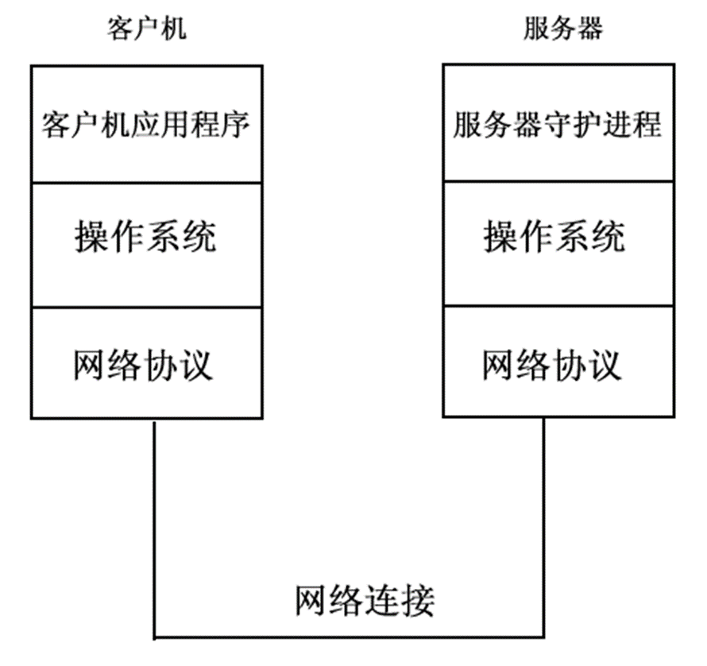
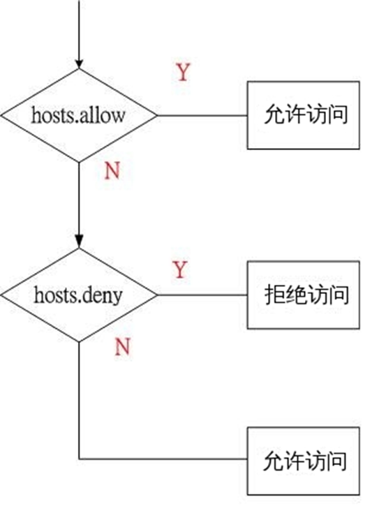
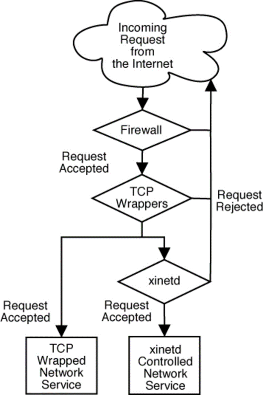

# 进程管理

## 内容要点

- 进程概述
- 进程管理
- 作业控制
- 守护进程（Xinetd 和 TCPWappers）
- 安排周期性任务

本章学习目标：

- 理解进程相关概念
- 掌握如何运行后台进程及注销后继续执行
- 掌握进程管理命令的使用
- 掌握作业控制的命令及快捷键的使用
- 理解并管理守护进程
- 掌握用 Xinetd 和 TCPWappers 配置访问控制的方法
- 掌握周期性任务的设置方法

## 进程相关概念

### 程序、进程和作业

- 程序（program）：机器指令的集合，文件形式存储
- 进程（process）：一个程序在其自身的虚拟地址空间中的一次 执行活动
- 作业/任务（job/task）：用户通过操作系统用户接口（Shell 或 X 环境）提交给计算机进行加工处理的程序。

  如用户发出一个打印命令，就产生一个打印作业/任务。

### 进程

- 进程是一个动态实体。
- 进程是处理器通过操作系统调度的基本单位。
- 每个进程的执行都独立于系统中的其它进程。
- 进程之间可以通过称为进程间通信（IPC）的机制进行交互。
- 当进程之间共享数据时，操作系统使用了同步技术来保证共享的合法性。

进程和程序概念的比较：

- 程序只是一个**静态的指令集合**；而进程是一个程序的**动态执行过程**，它具有生命期，是动态的产生和消亡的。
- 进程是**资源申请、调度和独立运行的单位**，因此，它使用系统中的运行资源；而程序不能申请系统资源、不能被系统调度、也不能作为独立运行的单位，因此，它不占用系统的运行资源。
- 程序和进程**没有一一对应的关系**。一方面一个程序可以由多个进程所共用，即一个程序在运行过程中可以产生多个进程；另一方面，一个进程在生命期内可以顺序的执行若干个程序。

多用户

### Linux 是多用户多任务系统

当多个用户同时在一个系统上工作时，Linux 要能够同时满足用户们的要求，而且还要使用户感觉不到系统在同时为多个用户服务，就好像每一个用户都单独拥有整个系统一样。

- 每个用户均可同时运行多个程序。为了区分每一个运行的程序，Linux 给每个进程都做了标识，称为进程号（process ID），每个进程的进程号是**唯一**的。
- Linux 给每个进程都打上了运行者的标志，用户可以控制自己的进程：给自己的进程分配不同的优先级，也可以随时终止自己的进程。
- 进程**从执行它的用户处继承 UID、GID**，从而决定对文件系统的存取和访问。

#### Linux 的多任务实现（分时技术）

Linux 不可能在一个 CPU 上同时处理多个任务（作业）请求，而是采用 “分时” 技术来处理这些任务请求。

分时技术是指所有的任务请求被排除一个队列，系统按顺序每次从这个队列中抽取一个任务来执行，这个任务执行很短的时间（几毫秒）后，系统就将它排到任务队列的末尾，然后读入队列中的下一个任务，以同样的方式执行。这样经过一段时间后，任务队列中的所有任务都被执行一次，然后又开始下一轮循环。

#### Linux 中的进程识别

使用 PID 区分不同的进程：

- 系统启动后的第一个进程是 init，它的 PID 是 1。
- init 是唯一一个由系统内核直接运行的进程。
- 除了 init 之外，每个进程都有父进程（PPID 标识）。

此外每个进程还有四个与用户和组相关的识别号：

- 实际用户识别号（real user ID，简称 RUID）
- 实际组识别号（real group ID，简称 RGID）
- 有效用户识别号（effect user ID，简称 EUID）
- 有效组识别号（effect group ID，简称 EGID）

#### 用户、进程与权限

RUID 和 RGID 的作用：识别正在运行此进程的用户和组。

- 一个进程的 RUID 和 RGID 就是运行此进程的 UID 和 GID。

EUID 和 EGID 的作用：确定一个进程对其访问的文件的权限。

- 除了产生进程的程序被设置 SUID 和 SGID 权限位之外，一般 EUID、EGID 分别和 RUID、RGID 相同。
- 若程序被设置了 SUID 或 SGID 权限位，则此进程相应的 EUID 和 EGID，将和运行此进程的文件的所属用户的 UID 或所属组的 GID 相同。

### 进程的启动方式

1. 手工方式：使用操作系统提供的用户接口，包括前台和后台（&）
2. 调度方式：按照预先指定的时间执行，包括 cron、at 和 batch

### 前台与后台

前台进程：指一个程序控制着标准输入/输出，在程序运行时，shell 被暂时挂起，直到该程序运行结束后，才退回到 shell。在这个过程中，用户不能再执行其它程序。

后台进程：用户不必等待程序运行结束就可以执行其它程序。

运行后台进程的方法是在命令行最后加上 “&”，例如：`$ sleep 10000 &`

> 在一个终端里只能同时存在一个前台任务，但可以有多个后台任务。

## 管理进程

### 查看系统种的进程（ps）

使用 ps（Process Status）命令查看进程状态信息：

- 显示哪些进程正在执行和执行的状态
- 进程是否结束、进程有没有僵死
- 哪些进程占用了过多的系统资源等

格式：`ps [选项]`

> 不带任何选项的 ps 命令：显示当前用户所在终端中的所有进程。
>
> 输出项包括：识别号(PID)、终端(TTY)、运行时间(TIME)、产生该进程所运行的命令(CMD)

选项：

| 选项              | 说明                                                                           |
| ----------------- | ------------------------------------------------------------------------------ |
| `-e`              | 显示所有进程，等价于 -A。                                                      |
| `-f`              | 完全（FULL）显示。增加显示用户名、PPID、进程起始时间。                         |
| `f`/`-H`          | 显示进程树，等价于 --forest。                                                  |
| `a`               | 显示终端上的所有进程，包括其他用户地进程。                                     |
| `x`               | 显示没有控制终端地进程。                                                       |
| `u`               | 面向用户的显示格式。增加显示用户名，进程起始时间，CPU 和内存占用百分比等信息。 |
| `-u <username>`   | 仅显示指定用户的进程。                                                         |
| `l`/`-l`          | 长格式显示。增加显示进程的 UID、PPID 和优先权值。                              |
| `w[w]`/`-w[w]`    | 加宽显示。通常用于显示完整的命令行。                                           |
| `o`/`-o <format>` | 由用户自定义输出列。                                                           |
| `--sort <order>`  | 指定按哪/哪些列排序，order 格式为：`[+/-] key [,[+/-] key [,...]]`             |

如：

```bash
ps -e
ps -ef
ps -eH
ps -elw

ps au
ps aux
ps axf
ps auxw
```

ps 常见的输出标记：

> ps 的输出依赖于用户所给的选项。

| 选项 | 说明                 | 选项  | 说明                            |
| ---- | -------------------- | ----- | ------------------------------- |
| UID  | 用户 ID              | START | 进程启动时间                    |
| USER | 用户名               | TIME  | 执行时间                        |
| PID  | 进程 ID              | STAT  | 进程状态                        |
| PPID | 父进程的 ID          | NI    | 优先权值 / nice 值              |
| TTY  | 启动进程的终端       | CMD   | 命令名（COMMAND）               |
| RSS  | 进程所用内存块数     | %CPU  | 进程所用 CPU 时间百分比（pcpu） |
| VSZ  | 进程所用虚拟内存块数 | %MEM  | 进程所有 MEM 百分比（pmem）     |

ps 命令的进程状态列（指 "STAT" 或 "S" 列的输出）：

| 选项 | 说明                                         |
| ---- | -------------------------------------------- |
| R    | 正在运行或处在运行队列中                     |
| S    | 休眠                                         |
| T    | 停止或被追踪                                 |
| W    | 进程在 RAM 中没有驻留页（2.6.xx 的内核无效） |
| D    | 不可中断的睡眠，通常指 I/O                   |
| Z    | 僵尸进程（已结束但未被父进程收回）           |
| X    | 已死进程（这个状态不会出现）                 |
| <    | 具有最高优先权                               |
| N    | 具有较低的优先权                             |

如：

```bash
# 指定输出列
$ ps o user,pid,ppid,pcpu,pmem,nice,cmd
$ ps -eo pid,tid,class,rtprio,ni,pri,psr,pcpu,stat,wchan:14,comm
$ ps axo stat,euid,ruid,tty,tpgid,sess,pgrp,ppid,pid,pcpu,comm
$ ps -eo “%p %y %x %n %c” # AIX风格

# 对指定列排序
$ ps -ef --sort user,-time
$ ps aux --sort -pcpu
$ ps aux --sort -pmem
$ ps o user,pid,ppid,pcpu,pmem,nice,cmd --sort nice
```

### 搜索进程

使用 `ps` 和 `| grep`：

```bash
$ ps aux | grep httpd

# 查找符合条件的进程PID
$ pgrep httpd
$ pidof httpd
$ ps -C httpd -o pid=
$ pgrep -U apache httpd
$ pgrep -G student -l
```

### 进程调度的优先权

- 进程的优先权决定对 CPU 的使用
- 进程在运行时可以享有不同等的优先权
- 进程的优先权受进程的 nice 值的影响（nice 值的范围为 -20\~19，默认是 0），值越小说明对 CPU 的使用越优先

查看进程优先级（看 NI 列的值）：

```bash
ps -l
ps -o comm,nice
```

### 改变进程调度优先权

#### 在启动进程时指定（nice）

nice 命令用于启动进程时指定优先级。

格式：`nice –<优先级改变量> 命令 [&]`

其中优先级改变量是指优先级的增量：

- 若为正，表示增加 nice 值，即降低进程优先权
- 若为负，表示减小 nice 值，即提高优先权
- 若缺省，则默认为 10，即 nice 值 增加 10

如：

```bash
nice –5 lp paper.pdf &

# 如超级用户（root）忙着打印一份演讲稿
nice –-10 lp report.pdf
```

> 注：
>
> - 使用 nice 同样可以改变前台任务的优先级；
> - 只有 root 才有权限提高一个进程的优先权。

#### 在进程运行过程中调整（renice）

renice 命令用于在进程运行后调整优先级。

- 在系统资源紧张时，可以通过降低其它不着急的进程的优先权，从而使得急用的进程能分得更多的 CPU 时间。
- root 可以提高进程的优先权，但普通用户没这个权限。

格式：`renice <优先级> [-p pid] [-u user] [-g gid]`

如：

```bash
renice 5 –p 2345 # -p 可以省略
```

> 注：
>
> - 普通用户调整 NI 值的范围是 0\~19，而且只能调整自己的进程。
> - 普通用户只能调高 NI 值，而不能降低。如原本 NI 值为 0，则只能调整为大于 0。
> - 普通用户一旦降低某个进程的优先级 (即增加优先值) 后，就无法再回复到原来的优先级。

### 进程信号（signal）

进程信号是在软件层次上对中断机制的一种模拟，在原理上，一个进程收到一个信号与处理器收到一个中断请求可以说是一样的。

进程信号是最基本的进程间通讯方式：

- 可以在进程之间直接发送，而不需要用户界面
- 可以在 Shell 中通过 kill 命令发送给进程

Linux 对每种进程信号都规定了默认关联动作。

查看可用的进程信号：

```bash
kill  -l
man 7 signal
```

### 进程信号和信号发送

常见的进程信号：

- SIGTERM | TERM（15）：正常终止 (默认)
- SIGKILL | KILL（9）：立即终止
- SIGHUP | HUP（1）：重读配置文件
- STOP（17）：暂停

给进程发送信号：

```bash
# 按PID：
kill [信号] PID …
# 按名称：
killall [信号] COMM …
# 按模式：
pkill [-信号] 模式
```

其中信号可以使用名称或数字号码。

### 杀死进程

杀死进程的原因：

- 该进程占用了过多的 CPU 时间
- 该进程锁住了一个终端，使其他前台进程无法运行
- 运行时间过长，但没有预期效果或无法正常退出
- 产生了过多的屏幕或磁盘文件的输出

可以使用 kill/killall 命令来杀死进程。

如：

```bash
$ kill 1234
# 也可写作：$ kill -9 1234
$ killall  myprog
# 也可写作：$ killall -9 myprog
```

> 注：
>
> - 使用 kill 前需要先用 ps 查看需要终止的进程的 pid；
> - `kill –9` 很霸道，它在杀死一个进程的同时，将杀死其所有子进程，使用时要谨慎。如错杀 login 进程或 shell 进程等。

### 作业控制

作业控制是指控制当前正在运行的进程的行为，也被称为进程控制。

暂时停止某个运行程序：使用 Ctrl + Z 或发送信号 17（STOP）

管理后台作业或暂停的作业：

- 列举作业号码和名称：`jobs`
- 在后台恢复运行：`bg [%作业号码]`
- 在前台恢复运行：`fg [%作业号码]`
- 发送信号：`kill -[信号] [％作业号码]`

## 守护进程

始终在后台运行并响应合法请求的程序称为守护（Daemon）进程。

- 守护进程不是由用户启动运行的，也不与终端关联。
- 一个实际运行中的系统一般会有多个守护进程在运行，且各个系统中运行的守护进程都不尽相同。
- 除非程序异常中止或者人为终止，否则它们将一直运行下去直至系统关闭。

> UNIX/Linux 的守护进程在 Windows 系统中被称作“服务”。

查看系统当前运行的守护进程：pstree

### 守护进程的分类

系统守护进程:

- 计划性任务 daemon，如 atd、crond
- 系统日志 daemon，如 syslogd
- 打印假脱机 daemon，如 cupsd、lpd
- 网络参数设置 daemon，如 network

网络守护进程：

- 各种网络协议侦听 daemon，如：sshd、httpd、sendmail、vsftpd
- 网络超级服务器（Supper Server），如：xinetd 或 inetd

### 客户机/服务器模型



### 网络守护进程的工作原理

网络程序之间的连接是通过端口之间的连接而实现的。在 C/S 模型中，服务器监听（Listen）在一个特定的端口上等待客户的连接。连接成功之后客户机与服务器通过端口进行数据通讯。

守护进程的工作就是打开一个端口，并且等待并监听（Listen）进入的连接。如果客户提请了一个连接，守护进程就创建（fork）子进程来响应此连接，而父进程继续监听更多的服务请求。因此，每个守护进程都可以处理多个客户服务请求。

### 超级服务器的引入

对于系统所要提供的每一种网络服务，都必须运行一个监听某个端口连接发生的守护程序，这通常意味着系统资源的浪费。

为了避免系统资源浪费引入了“超级服务器”：

1. 超级服务器启动后同时监听它所管理的服务的所有端口
2. 当有客户提出服务请求时：
   - 超级服务器会判断这是对哪一个服务的请求，然后再开启与此服务相应的守护进程
   - 由超级服务器产生的某服务的进程处理客户的请求，当处理结束便终止此服务进程
   - 超级服务器本身继续监听其他服务请求

### 守护进程的启动方式

独立启动：

- 独立运行的守护进程由 init 脚本负责管理
- 独立运行的守护进程的脚本存放在 /etc/rc.d/init.d/ 目录下
- 所有的系统服务都是独立运行的。如：crond、syslogd 等
- 一些常用的网络守护进程是独立运行的。如：httpd 等

瞬态启动：

- 由网络超级服务器（xinetd）运行的守护进程
- 由 xinetd 管理的守护进程的配置文件存在 /etc/xinetd.d/ 目录下
- 默认的 xinetd 的主配置文件是 /etc/xinetd.conf
- 一些不常用的网络守护进程是由 xinetd 启动的，如：telnet、tftp 等
- **xinetd 本身是独立运行的守护进程**

## 守护进程管理工具

### 用 chkconfig 管理守护进程

chkconfig 的功能：

- 添加指定的新服务
- 清除指定的服务
- 显示由 chkconfig 管理的服务
- 改变服务的运行级别
- 检查服务的启动状态

chkconfig 命令的格式

```bash
chkconfig --list [server-name]
chkconfig --add server-name
chkconfig --del server-name
chkconfig [--level levels] server-name <on|off|reset>
```

如：

```bash
# 查看指定的服务在所有运行级别的运行状态
chkconfig --list sendmail
# 显示由 chkconfig 管理的所有服务
chkconfig --list
# 添加一个由chkconfig管理的服务
chkconfig --add httpd
# 更改指定服务在指定运行级别的运行状态
chkconfig --level 35 httpd on
```

使用 chkconfig 增加一个服务：

1. 服务脚本必须存放在 /etc/init.d/ 目录下
2. 使用命令 `chkconfig --add servicename` 来创建 在 chkconfig 工具服务列表中增加此服务，此时服务会被在 `/etc/rc.d/rcN.d` 中赋予 K/S 入口
3. 使用命令 `chkconfig --level 35 mysqld on` 修改服务的默认启动等级

### 管理守护进程

service/systemctl 的功能：在系统运行期间改变守护程序的运行状态

命令格式：

```bash
# service server-name status
service <server-name> start|stop|restart

# systemctl status server-name
systemctl is-active <server-name>
systemctl start|stop|restart <server-name>
```

如：

```bash
# 查看系统中的所有守护进程的状态
service --status-all
# 查看某个具体的守护进程的状态
service vsftpd status

# 启动或停止某个守护进程
# 独立运行
service httpd start|stop|restart
# 由xinetd运行
chkconfig tftp on|off
service xinetd restart
```

### 超级服务器

xinetd 是新一代的网络守护进程服务程序，提供类似于早期的 inetd + tcp_wrapper 的功能，但与之相比 xinetd 更加强大和安全。

xinetd 的功能：

- 支持 tcp、ucp、RPC 协议服务
- 基于时间段的访问控制
- 功能完备的 log 功能，能限制 log 文件大小
- 能有效的防止 DoS 攻击（Denial of Services）
- 能限制同时运行的同一类型的服务器数目
- 能限制启动的所有服务器的数目
- 整合了 TCP Wrappers 的 libwrap.so 库

#### xinetd 的配置

xinetd 的配置文件：

- /etc/xinetd.conf
- /etc/xinetd.d/\*

xinetd 的常见配置参数：

- disable {no|yes} 定义是否启动 （no 表示开启，yes 表示关闭）
- socket_type {stream|dgram} 表示套接字格式 （stream 为 TCP，dgram 为 UDP）
- protocol 协议类型 （这些是需是 /etc/protocol 里可用的）
- wait {yes|no} 允许并发数 （yes 单线程，no 多线程）
- user 运行身份
- server 有哪个文件/程序启用该服务
- server_args 传递的参数
- only-from 白名单
- no-access 黑名单
- access-time 定义访问时间
- log-type {SYSLOG|FILE} 定义输出日志 （SYSLOG 定义日志类型，级别；FILE 定义日志存放位置）
- bind 监听 IP
- log-on-success 记录登陆成功的信息
- log-on-failure 记录登陆失败的信息
- per-source 资源限制，限制某一 ip 同时连接请求数
- phier-source = UNLIMITED 定义来源限制 表示不做限制
- cps = n m 定义每秒最大连接数 定义每秒最大连接数为 n，超出后等待 m 秒后再尝试连接

如：

```json
service tftp
{
  disable      =  no
  socket_type  =  dgram
  protocol     =  udp
  wait         =  yes
  user         =  root
  server       =  /usr/sbin/in.tftpd
  server_args  =  -s /tftpboot
  cps          =  100 2
  flags        =  IPv4
  instances    =  20
  per_source   =  1
  access_times =  7:00-12:00 13:30-19:00
  only_from    =  192.168.1.0/24
}
```

## TCP Wrappers

TCP Wrappers 即 Transmission Control Protocol Wrappers，是一种应用层的网络访问控制程序，原本是个人开发的免费软件，但随着广泛的应用逐渐成为一种标准的安全工具，并在 RHEL/CentOS 中是默认安装的。当然我们也可以手动安装：

```bash
yum -y install tcp_wrappers
```

TCP Wrappers 使用访问控制列表（ACL）实现主机访问控制：

- /etc/hosts.allow 是一个许可表
- /etc/hosts.deny 是一个拒绝表

### TCP Wrappers 实现访问控制



- 读取 /etc/hosts.allow 文件，如果明确允许访问，则提供访问且不再检查 /etc/hosts.deny
- 读取 /etc/hosts.deny 文件，如果明确拒绝访问，则指定计算机将被拒绝访问。
- 如果两个文件中都没有访问者的计算机名称或 IP 地址，则自动提供访问权。
- 如果不存在这两个文件或文件内容为空，则 TCP_Wrappers 的访问控制功能被禁用。

### TCP Wrappers 保护机制的实现方式

1. 由网络服务程序调用 `libwrap.so._` 链接库（内置 `libwrap.so._` 库支持的网络服务程序都能使用 TCP Wrappers 来实现访问控制）
2. 检查 TCP Wrappers 的支持

   ```bash
   # 显示所有支持 TCP Wrappers  的软件包
   rpm -q --whatrequires libwrap.so.0

   # 查看某网络服务程序对 TCP Wrappers 的支持
   ldd $(which sshd) | grep libwrap
   # 或者：
   strings -f /usr/sbin/sshd | grep hosts_access
   ```

> RHEL/CentOS 中支持 TCP Wrappers 的服务程序：
>
> `rpm -q --whatrequires libwrap.so.0`
>
> - sendmail-8.13.8-8.el5
> - quota-3.13-1.2.5.el5
> - xinetd-2.3.14-10.el5
> - tftp-server-0.49-2.el5.centos
> - openssh-server-4.3p2-41.el5_5.1
> - vsftpd-2.0.5-16.el5_5.1
> - nfs-utils-1.0.9-47.el5_5
> - ………
>
> 意义：实现对多个服务程序实现集中式管理（Centralized Management）

### TCP Wrappers 与防火墙

通常做法是在 Linux 操作系统上安装 Netfilter/iptables 防火墙来处理网络连接。

虽然防火墙有非常广泛的用途，但他却不是万能的。例如它无法处理类似的向连接发起者发送一些文本这样的任务。TCP Wrappers 能够完成它以及更多的其他事情，甚至还能提供的一些额外的安全功能。

但 TCP Wrappers 不应被视为好的防火墙的替代品。TCP Wrappers 应结合防火墙或其他安全加强设施一并使用，为系统多提供一层安全防护。

下面是 TCP Wrappers 与防火墙图示：



### TCP Wrappers 的配置文件语法

/etc/hosts.allow 和 /etc/hosts.deny 语法：

`daemon:hosts:options`

其中：

- deamon：可填 ALL 或指定守护程序名称
- hosts：
  - 填 ALL
  - 填 hostname(s)
  - 填 net. 地址，如 `192.168.` 表示匹配 192.168.x.x 的地址
  - 填 net/netmask，如 172.0.0.0/255.0.0.0 表示匹配 172.x.x.x 的地址
- options：
  - allow / deny
  - spawn/twist shell command
  - 其他选项也可填写

> 以 `#` 开始的行为注释；`\` 为续行符
>
> 任何修改都立即生效，不需要重新启动服务

其中主机名填写：

- LOCAL：本地主机
- KNOWN：可解析域名的主机
- UNKNOWN：不可解析域名的主机
- PARANOID：IP 与其主机名不符的客户
- IP 地址
- 域名或主机名，如 `.abc.com`, `www.abc.com`
- IP 地址段：如 `192.168.0.` ，`12.23.`
- 使用 CIDR（无类型域间选路），如 192.168.0.0/22
- 使用 client@host，如 osmond@www.abc.com

主机和服务宏定义可填写：

- ALL
- EXCEPT（可嵌套）

主机列表可填写：

```bash
sshd: centos.example.com,192.168.0.254
sshd: .example.com
sshd: .cracker.org EXCEPT trusted.cracker.org
sshd: 123.113.103.,123.113.13.207,LOCAL
sshd: 123.113.103. EXCEPT 123.113.103.207
sshd: 192.168.0.0/255.255.254.0
sshd: 192.168.0.0/23
sshd: ALL
sshd: ALL EXCEPT 192.168.1.
sshd: ALL EXCEPT 192.168.1.,PARANOID
sshd: /etc/acl/mylists.hosts
```

如要求仅允许本地主机、192.168.0.x 网段、mynet.com 域访问系统中的 telnet 和独立启动的 vsftpd 服务：

- 编辑 /etc/hosts.deny 拒绝所有主机访问：`in.telnetd,vsftpd: ALL`
- 编辑 /etc/hosts.allow 开放允许访问的主机：`in.telnetd,vsftpd: LOCAL, 192.168.0., .mynet.com`

或者使用拓展语法，在 /etc/hosts.allow 中添加如下两条访问控制规则：

```bash
in.telnetd,vsftpd: LOCAL, 192.168.0., .mynet.com
in.telnetd,vsftpd: ALL: deny
```

注意 allow 或 deny 扩展必须作为一条规则的最后一个选项出现。

> 注：
>
> - 尽量使用 IP 地址，而不用主机名或域名
> - 使用 allow 或 deny 扩展作为规则的最后一个选项，可以将所有访问规则集中设置在一个配置文件中
> - `<daemon list>` 为 process name，而非 service name。如 in.telnetd 非 telnet。

## 安排自动化任务

### crond 守护进程

crond 守护进程负责监控周期性任务的执行。

crond 守护进程的执行参数参考 /etc/sysconfig/crond。

控制普通用户的使用：

- 若 /etc/cron.allow 存在，仅列在其中的用户允许使用。
- 若 /etc/cron.allow 不存在，检查/etc/cron.deny，没有列于其中的所有用户允许使用。
- 若两个文件均不存在，仅允许 root 用户使用。
- 空的 /etc/cron.deny 文件，表示允许所有用户使用。（默认值）

#### crond 的运行机制

- 搜索 crontab 文件并载入内存（crontab 文件即 /var/spool/cron/ 目录下以用户名命名的文件以及 /etc/crontab 文件）
- crond 守护进程启动后，检查是否有用户设置了 crontab 文件，如果没有就转入休眠状态，释放系统资源
- crond 守护进程每分钟检查一次 crontab 文件，检验当前是否有需要执行的命令。命令执行结束后，没有被重定向的输出，都将**作为邮件发送**给安排次任务的所有者

### crond 命令

作用：用于生成 cron 进程所需要的 crontab 文件

命令格式：

- `crontab [-u user] <file>`
- `crontab [-u user] {-l/-r/-e}`

命令参数：

- \-l：在标准输出上显示当前的 crontab
- \-r：删除当前的 crontab
- \-e：使用编辑器编辑当前的 crontab 文件。当结束编辑离开时，编辑后的文件将自动安装。

> 任何被允许的用户都可以使用 crontab 安排任务。

### crontab 文件的格式

详情参见 `man 5 crontab`。

每一行由 5 个时间字段及命令组成：

`minute hour day-of-month month-of-year day-of-week [username] commands`

其中：

- 五个时间字段：
  - minute：一小时中的哪一分钟 \[0 ～ 59]
  - hour：一天中的哪个小时 \[0 ～ 23]
  - day-of-month：一月中的哪一天 \[1 ～ 31]
  - month-of-year：一年中的哪一月 \[1 ～ 12]
  - day-of-week：一周中的哪一天 \[0 ～ 6]
- 两个执行字段：
  - username: 以指定的用户身份执行 commands。省略此字段表示以安排该任务的用户身份执行 commands。
  - commands: 要执行的命令，可以是多行命令或者是脚本调用。

注意：

- 除了 username 项，所有项都必须填入。
- 如果用户不需要指定其中的几项时间，那么可以使用统配符 \* 表示任何时间。
- 每个时间字段都可以指定多个值，它们之间用 `,` 间隔，如：`1,3,5`。
- 每个时间字段都可以指定范围，它们之间用 `-` 间隔 ，如：`12-20`。
- 每个时间字段都可以使用 `*/n` 表示每隔 n，如：`*/2`。
- 命令应该给出绝对路径，或设置 PATH 环境变量。
- 用户必须具有运行所对应的命令或程序的权限。
- 注释行以 # 开头。

### cron 的使用

- 直接使用命令 `crontab –e` 加载任务：

  在编辑器中输入：`00 03 * * 2,4,6 shutdown -r +10`；存盘退出。

- 也可以先创建 crontab 文件，然后加载任务：

  ```bash
  echo “00 03 * * 2,4,6 shutdown -r +10” > /root/reboot.cron
  crontab /root/reboot.cron
  ```

cron 任务加载以后，可以到 /var/spool/cron 目录进行确认。

cron 使用范例：

1.  每月 1 日和 15 日凌晨 1:30 使系统进行维护状态，重新启动系统：

    ```
    30 01 1,15 * * shutdown -r +10 > /dev/null
    ```

2.  每天凌晨的 2 点删除 /ftp/incoming/temp 目录下的所有文件：

    ```
    00 02 * * * rm-rf /ftp/incoming/temp
    ```

3.  每天凌晨 1 点删除 /tmp 目录下的 7 天没有修改过的所有子目录，但不包括 tmp 目录本身和 lost+found 目录：

    ```
    00 01 * * * find /tmp !-name.! -name lost+found \
     -type d -mtime +7 -exec /bin/rm-rf {} ';'
    ```

4.  每天早上 8 点将 /var/log/secure 文件内容发送给 aa@163.com：

    ```
    0 8 * * * mail aa@163.com < /var/log/secure
    ```

5.  每隔两个小时将命令 `netstat -a` 的输出发送给 aa@163.com：

    ```
    0 */2 * * * netstat -a | mail aa@163.com
    ```

6.  每天 7\~19 点开放 samba 服务：

    ```
    0 7 * * * service smb start
    0 19 * * * service smb stop
    ```

7.  每星期日晚上 2 点查看 /home 目录下使用量最大的前十名用户：

    ```
    0 2 * * 0 root du -sh /home/* | sort -nr | head -10
    ```

### 系统的 cron 任务

crond 守护进程还将搜索系统的 cron 任务配置文件 /etc/crontab。使用 /etc/crontab 文件为系统管理员安排 cron 任务提供了方便。

以下目录中存放了 /etc/crontab 文件运行时执行的文件：

- `/etc/cron.hourly/`：存放每小时要执行的任务文件
- `/etc/cron.daily/`：存放每天要执行的任务文件
- `/etc/cron.weekly/`：存放每周要执行的任务文件
- `/etc/cron.monthly/`：存放每月要执行的任务文件

管理员在 /etc/cron.\*ly 目录下建立脚本文件来安排 cron 任务，且在脚本中只需写要安排执行的命令即可。

此外 /etc/cron.d/ 目录包含额外的系统 crontab 文件。

/etc/crontab 文件：

```bash
cat /etc/crontab
# SHELL=/bin/bash
# PATH=/sbin:/bin:/usr/sbin:/usr/bin
# MAILTO=root
# HOME=/
# # run-parts
# 01 * * * * root run-parts /etc/cron.hourly
# 02 4 * * * root run-parts /etc/cron.daily
# 22 4 * * 0 root run-parts /etc/cron.weekly
# 42 4 1 * * root run-parts /etc/cron.monthly
```

> run-parts 是 crontab 软件包的一个命令组件，它用于执行指定目录下的所有可执行文件。
